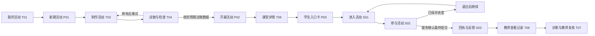

# OpenForm 页面与主流程方案

本稿根据已确认需求起草，供后续 `/plan-design-review` 评审。它定义页面职责、导航和主要操作，不代表页面方案已经获得用户逐页确认，也不代表完成专项设计评审、原型实现或产品开发。

## 1. 依据与页面划分原则

- 功能范围以 [正式需求方案](openform-classroom-platform.md) 的 Accepted Scope、D1–D14、权限矩阵及状态约定为准。
- 视觉沿用已确认的 [DESIGN.md](../../DESIGN.md) 与 [VI 规范](../brand/visual-identity.md)。
- [现有预览](../../preview.html) 提供活动列表、制作、诊断、资源、成员、学生参与及组件示例；本稿参考其中的列表、专注制作、统计与证据、移动参与模式，但不把演示导航当成完整产品结构。
- 首版同时覆盖个人空间、校园多用户空间。学校能力不后补；页面按任务复用，权限按当前空间和具体活动决定。
- 优先让教师完成一节课。全局入口放“我的活动”“我的课堂”“我的班级”，制作、诊断和发布从具体对象进入。

本稿建议 **25 个业务页面视图：公共 2、教师 12、校园管理 6、学生 5**，另列 1 个独立运维视图以承接已批准的备份恢复要求。页面视图表示可单独进入的业务上下文，不等于必须开发 25 套独立组件；资源管理、设置、班级详情等明确复用。

页面数量是本稿的组织建议，不是新增功能指标。弹窗、抽屉、页内标签、三种活动样板和各类错误状态不重复计为页面。编号 G/T/C/S/O 用于后续设计追踪，与需求方案中的实施任务 T1–T10 无关；本稿不固定最终 URL。

### 1.1 四个对象必须能分清

| 对象 | 教师理解 | 页面归属与关键区别 |
|---|---|---|
| 活动 | 一份可以反复使用的教学材料 | T01–T04：草稿、题目、页面、收集内容和版本；没有班级也能制作 |
| 课堂 | 一次具体开展 | T05–T07：使用固定活动版本，有自己的参与者、提交、进度和报告；再次开展创建新课堂 |
| 校内资源 | 同事可发现和复制的已验证活动版本 | T10–T11、C04：复制页面和教学配置，不复制名单、进入码或学生记录 |
| 历史档案 | 从其他空间或实例导入的受限课堂资料 | T12：保留来源，单独查阅；不并入当前学生身份、课堂统计或本人历史 |

教师端与校园管理端是同一工作台按权限呈现的两个工作区域。学生端有独立参与入口，不使用教师侧栏。管理员兼任教师时可以切换工作区域，但管理角色本身不开放学生作答。

## 2. 导航与首页

### 2.1 教师工作台

```text
顶栏：OpenForm ｜ 教学工作台 ｜ 校内资源〔学校空间〕 ｜ 校园管理〔有管理权限〕
                                                 当前空间切换 ｜ 账号菜单

教学工作台侧栏
├─ 我的活动 T01〔默认首页〕
│  └─ 活动详情与版本 T02
│     ├─ 制作活动 T03 → 试做与检查 T04
│     ├─ 开展活动 P02 → 课堂详情 T06
│     └─ 协作、发布校内资源、复制或导出〔对象内操作〕
├─ 我的课堂 T05
│  └─ 课堂详情 T06 → 教学诊断 T07
├─ 我的班级 T08
│  └─ 班级详情 T09
└─ 资料迁移与档案 T12〔次级入口〕

校内资源：资源库 T10 → 资源详情 T11 → 复制到当前学校的我的活动
账号/空间菜单：空间设置 G02〔个人设置或有权管理的学校设置〕
```

个人空间隐藏“校内资源”“校园管理”；其拥有者可以维护自己的班级名单、进入码和模型配置。学校空间的教师只看到本人及明确授权的活动、课堂与班级。

教师首页直接进入活动列表；有进行中的课堂时，在列表上方提供紧凑的继续入口。没有活动时展示“描述教学想法”“从样板开始”“导入已有网页”，不要求先建班级或配置学校。

“制作活动”需要草稿上下文，“教学诊断”需要课堂及报告上下文，因此不作为全局侧栏中的孤立页面。返回列表时保留当前空间、筛选和页码。

### 2.2 校园管理

```text
校园管理侧栏
├─ 成员与权限 C01〔管理默认首页〕
├─ 班级与任课 C02 → 班级详情 T09〔管理视图〕
├─ 学生名册 C03
├─ 资源管理 C04 → 资源详情 T11〔管理视图〕
├─ 资源交接 C05
├─ 模型与额度 G02〔模型标签〕
├─ 空间与数据设置 G02〔基本信息、数据规则标签〕
└─ 运行状态与操作记录 C06
```

纯管理人员登录学校后进入 C01；具备教学角色的人可进入教学工作台。首版不增加独立的学校经营大屏、全校成绩排行或教务首页。

### 2.3 学生入口

```text
活动链接 / 二维码 / 课堂码 → 进入活动 S01 → 参与活动 S02
                                                   ↓
                                          提交回执与反馈 S03
                                                   ├─ 我的记录 S04
                                                   └─ 共享结果 S05〔教师开放时〕

个人进入码验证 → 当前空间内的我的记录 S04 → 获准查看或继续的活动
```

学生无需先浏览门户或注册个人账号。课堂码定位课堂，个人进入码验证学生身份；两者分开命名、分开输入。正在作答时只保留当前活动、保存状态与必要动作，历史和共享结果放在次级入口。

### 2.4 全局上下文

空间切换放在固定位置；切换后重新载入该空间可访问内容，不沿用另一个空间的名单、筛选对象或课堂权限。加入学校不搬移个人资产。需要跨空间迁移时走 T12，并明确源、目标和授权。

教师页面标题中区分活动名称与课堂名称；课堂至少显示所属空间、班级或“快速活动”、负责人和固定版本。学生页只展示参与所需的信息，不带教师后台地址。

## 3. 公共页面

| 编号 / 页面 | 入口与使用者 | 首屏内容 | 主要动作与出口 |
|---|---|---|---|
| G01 登录与加入空间 | 教师/管理登录入口、成员邀请链接 | 产品与部署标识、登录区域；邀请场景显示学校及拟加入身份 | 登录后回到获准访问的目标；接受邀请后进入学校空间；账号创建、验证和找回作为该入口的分支，不新增营销注册流程 |
| G02 空间设置 | 账号菜单；校园管理的配置入口 | 当前空间；按权限展示“基本信息”“模型与额度”“数据规则”标签 | 个人拥有者配置个人空间；学校管理员配置学校空间；保存后显示结果及生效范围，返回原工作区域 |

G01 的具体认证方式仍需工程评审确定。首版学校 SSO 已后置，页面不预设短信、微信扫码或统一身份已可用；校内无公网部署须有不依赖外网的验证路径。

G02 中模型配置包含已支持的服务类型、连接状态、调用范围、限额与实际使用情况；密钥只在填写/更换时输入，已保存值不回显完整内容。数据规则包含保留期限、导出/删除权限及其影响说明。个人与学校配置分开，不自动使用教师的个人密钥为学校任务付费。普通学校教师在相关生成/分析页面查看可用性和自己获准使用的额度，不获得学校配置编辑权。

## 4. 教师端页面清单

| 编号 / 页面 | 解决的问题 | 首屏信息与主要区块 | 主要动作、入口和出口 |
|---|---|---|---|
| T01 我的活动 | 找到可继续制作或再次使用的活动 | 搜索与类型/状态/归属筛选；活动名称、草稿/版本、最近课堂、更新时间 | 主动作“新建活动”P01；活动进入 T02，草稿可直接到 T03，进行中课堂直接到 T06；协作活动作为筛选，不复制一套列表 |
| T02 活动详情与版本 | 分清材料、版本和历次开展 | 教学目标与来源、当前草稿、已固定版本、试做状态；“版本”“历次课堂”标签 | 按当前状态“继续制作”或“开展活动”P02；进入 T03/T04/T06；页内管理协作 P05、发布资源 P04、复制和导出；查看旧版，不原地改写旧版 |
| T03 制作活动 | 把教学想法、样板或已有网页变成可用草稿 | 教学要求与材料、收集内容、题目及评价规则、学生预览；已有生成/导入任务状态 | 生成、自然语言修改、保存草稿、进入 T04；模板和外部 HTML 最终进入同一制作器；接入细节按需展开，首版不建设通用代码 IDE |
| T04 试做与检查 | 确认页面可用且实际收到了预期数据 | 当前草稿修订、活动试做区；收到的答案/进度/最终提交及适用图片；未通过项 | 实际试做并核对结果；失败返回 T03；通过后到 P02 或返回 T02；试做记录与正式课堂隔离，草稿变化后重新检查 |
| T05 我的课堂 | 快速找到当前或历史的一次开展 | 接收状态、班级/快速活动、负责人、活动版本、开始时间、参与/完成情况 | 首屏优先进行中课堂；打开 T06；可从已结束课堂发起新一次开展；不把旧课堂“重新开放” |
| T06 课堂详情 | 课中管理接收，课后查看完整结果 | 固定版本与课堂状态；“课堂概览”“参与与记录”“诊断报告”“反馈与共享”标签 | 按状态开放/暂停/恢复接收/结束；展示学生入口 P03；查看记录 P06、图片与进度；进入 T07；导出及有权的数据删除 P10；共享设置 P07 |
| T07 教学诊断 | 依据本次课堂结果决定再讲什么 | 报告选择及固定截止时间；确定性统计、题目/环节表现、开放回答归类、教学建议、实际分析覆盖 | 生成标准诊断或输入自定义分析要求；打开依据 P06、标记教师复核；新数据需生成新报告，旧报告不漂移；回到 T06 |
| T08 我的班级 | 找到有权教学的班级 | 班级名称、人数、任教学科和近期课堂；个人/学校空间上下文 | 打开 T09；个人空间可创建和维护自己的班级；学校教师无任课班级时提示联系管理员，同时仍可开展快速活动 |
| T09 班级详情 | 在名单上下文中开展活动、发放个人码 | 班级信息；“学生名单”“本班课堂”标签；管理视图增加“任课关系” | 有权任课教师选择活动开展、为已有名单学生发码/重置 P08、查看获授权课堂；学校管理员维护名单/任课；个人拥有者维护个人名单 |
| T10 校内资源库 | 找到同事可复用的活动 | 名称、学科/年级/样板类型筛选；作者、固定版本、验证与来源更新状态 | 查看 T11、复制到当前学校的我的活动；空库引导有发布权者从 T02 发布；不混入公共市场 |
| T11 资源详情 | 在复制前判断是否适用 | 教学目标、适用对象、页面预览、收集内容、发布版本、作者与来源 | 主动作“复制到我的活动”P09，完成进入独立草稿 T03；发布者/资源管理员可撤回；源更新时展示新版本，不覆盖既有副本 |
| T12 资料迁移与档案 | 迁移活动材料，受限查阅导入的历史资料 | “导入导出任务”“历史档案”标签；来源/目标、包类型、内容范围、校验及处理结果 | 上传迁移包、预检、确认导入、查看失败原因/重试；下载已获授权的导出；选择档案查看只读记录及图片，不并入本班统计 |

### 4.1 制作与试做

P01 提供三个开始方式：“描述教学想法”“使用样板”“导入已有网页”。三种方式都进入 T03；其中内置样板覆盖随堂测验、词汇/概念闯关、实验探究，不为每个样板另造制作产品。

T03 延续现有预览的浅色专注布局，左侧教学要求和收集内容，右侧学生预览。修改先形成草稿；生成完成只表示已有候选内容，试做有真实接收记录后才显示接入通过。通过标记绑定当前修订，修改后失效。T04 可复用学生运行界面，但明确标为试做，不向正式课堂写数据。

T04 分开呈现“页面运行”“数据接入”“教学内容需教师检查”。需要在校内无公网使用时，还须显示必要依赖检查和断网试做结果；只能联网使用的活动不能被标为校内离线可用。这里的无公网可用要求浏览器仍能连接校内服务；与学生设备断网暂存不是同一种状态。

### 4.2 课堂与诊断

T06 的课堂概览展示已进入、进行中、有效完成和最新接收时间；有名单时另外列未进入名单和全班完成率。快速活动没有名单时只显示实际参与与完成，不推算缺席。

“参与与记录”按参与身份组织，区分进度、过程记录和最终提交，可展开多次尝试；小组实验由指定记录者提交，小组名称是活动字段，不把一条小组记录计作全组学生完成。

T07 每份报告固定活动版本、数据截止时间和统计口径。首屏同时说明全部参与者、完成/未完成情况、模型实际覆盖及遗漏；不因只分析完成提交而隐藏未完成学生。未答与答错分开，无答案标准不显示正确率，时长不解释为掌握程度。图片可作为证据打开，但首版不声称 AI 已理解图片。

默认按每人最近一次有效完成提交统计题目表现，尝试次数单列；正确率分母是该题有有效作答的人数，未答人数另列。至少一次有效完成提交才计为完成；重试不新增尝试，学生主动重新尝试保留新记录。

报告结论中的“查看依据”打开 P06，并保留回到该结论的位置；没有查看对应原记录的权限时不给出越权预览。数据按授权删除后，相关报告标记失效或引用不可用，不恢复缓存正文。教师复核是确认使用依据，不自动发布下一活动或形成正式成绩。

### 4.3 资源、协作与迁移

活动编辑协作、课堂数据查看、资源发布分别授权。T02 的活动协作入口和 T06 的课堂协作入口使用同一 P05 组件，但操作对象和可授予权限清楚区分。

T11 复制默认留在当前学校空间，并保留资源来源和固定版本；不会因为复制资源就获得源活动编辑权。跨空间迁移通过 T12 显式选择和校验包，不以空间切换自动完成。

T12 把“活动资源包”和“含课堂记录的数据包”分开：前者导入为活动草稿，后者导入为受限历史档案。都先给出可读的预检清单，再确认导入；失败不出现半个可用活动或档案。档案查看需要单独授权，不按学生同名关联，不导入可直接登录的身份和凭据。旧 QuickForm 包仅按已验证的支持清单接入。

## 5. 校园管理端页面清单

| 编号 / 页面 | 解决的问题 | 首屏信息与主要区块 | 主要动作、入口和出口 |
|---|---|---|---|
| C01 成员与权限 | 谁能加入学校、承担什么管理职责 | 成员搜索、邀请/有效/停用状态、角色和已授予范围 | 邀请成员、查看/调整学校管理角色、停用访问；需转移资源时进入 C05；具体课堂协作仍从对象授权，不能用“管理员”概括全部学生数据权限 |
| C02 班级与任课 | 哪些班级存在、由哪些教师授课 | 班级列表、学生数、任课教师/学科；缺少任课关系的提示 | 新建/编辑班级，指定有效成员的任课关系；进入 T09 管理视图或 C03 维护名单；不新增排课和考务 |
| C03 学生名册 | 维护学校内稳定的学生身份 | 学校内部标识、姓名、所属班级、记录状态；区分同名学生 | 建立/维护名单、调整班级关系、处理个人码撤销/重置；换码换班保留同一身份；不展示全校学生答卷或长期能力标签 |
| C04 资源管理 | 维护本校已共享资源 | 复用 T10 的列表与筛选，增加发布者、发布/撤回状态及版本信息 | 查看 T11；按资源管理权撤回，查看来源更新；撤回不删除教师已有副本，也不授予改写源活动权 |
| C05 资源交接 | 成员离岗后把学校资产交给合适的人 | 来源成员、待交接活动/课堂/库资源、当前负责人；接收人及影响预览 | 选择有效接收人和授权范围，确认后查看结果；失败保留原归属；保留历史作者，不包含个人空间资产；管理员仅预览管理所需元信息 |
| C06 运行状态与操作记录 | 判断本空间是否能正常开展课堂、追查管理变化 | “运行状态”“操作记录”标签；收集/模型/存储可用情况、任务异常、配额；关键授权、导出、删除、配置、交接记录 | 查看本空间故障和恢复说明，跳回有权处理的配置/任务；无观测数据时显示未知；不展示其他学校数据或学生原文 |

模型与额度、空间基础信息和数据规则使用 G02，不另做一套学校设置页。C06 可以展示获准公开给校方的备份状态和负责人联系方式；整实例备份操作不放在校园管理员通用菜单里。

T09 的管理视图只开放管理员有权维护的学生、班级和任课信息。“本班课堂”及回答明细仍按教学授权控制。学校教师可以给获授权名单学生发码，不能据此新建另一套同名身份或看到其他教师的课堂。

成员停用及时撤销访问，不以先完成资源交接为前提；随后由有权管理员处理 C05。需要交接的是学校归属资产，原个人空间继续按个人归属处理。接收人是否仍有效、授权是否可授予在提交时再次核验。

### 5.1 独立运维视图

| 编号 / 页面 | 谁能进入 | 主要内容与动作 |
|---|---|---|
| O01 实例备份与恢复 | 单独授权的部署运维/恢复管理员；托管环境由服务运营方负责 | 查看备份时间点与验证结果、创建受控备份、在干净环境恢复并核对、重新授权后开放；明确可能缺失的时间段及失败状态 |

O01 独立于三个业务端的日常导航。相同人员兼任校管与运维也需分别授权；恢复后不自动启用旧会话、旧个人码和旧成员授权。界面具体形态由工程设计决定，本稿只保留已批准能力的入口和职责，不扩展服务器集群管理。

## 6. 学生端页面清单

| 编号 / 页面 | 解决的问题 | 首屏信息与主要区块 | 主要动作、入口和出口 |
|---|---|---|---|
| S01 进入活动 | 找到正确活动并确认可用身份 | 活动/学校/教师名称、开放状态、参与说明；临时进入或个人码验证 | 活动允许临时参与时开始/恢复同浏览器会话；班级身份通过个人码验证；成功到 S02；独立个人码入口验证后可到 S04 |
| S02 参与活动 | 完成测验、闯关或实验记录 | 当前题目/环节、内容区、作答进度及独立的保存状态 | 作答、保存/自动保存、退出后继续、最终提交；按样板提供图片上传；提交确认后到 S03；开放时可进入 S05 |
| S03 提交回执与反馈 | 明确这次是否已交、何时交、能看到什么反馈 | 已收到的提交时间、所属课堂、尝试记录；教师允许公布的反馈 | 查看本次获准内容、到 S04/S05；课堂允许新尝试且仍接收时返回 S02，产生新尝试而非覆盖旧回执 |
| S04 我的记录 | 找回自己的已保存进度和获准历史 | 当前空间身份；进行中/已完成记录、时间、当前可见范围 | 继续获准且仍可参与的活动、查看历史回执/反馈；稳定身份可跨设备，临时身份只显示当前课堂内该凭据可访问的记录 |
| S05 共享结果 | 查看教师明确开放的课堂内容 | 开放的汇总或筛选内容、适用范围和数据时间 | 阅读获准结果、返回当前活动；教师未开放时不显示入口，直接访问仍核验权限 |

### 6.1 三种活动复用一个参与框架

| 样板 | S02 内容形态 | 需要连续保留的内容 |
|---|---|---|
| 随堂测验 | 题目导航、客观/开放回答、提交 | 当前答案、题目位置和提交尝试 |
| 词汇/概念闯关 | 当前关卡、练习反馈、继续下一关 | 关卡进度、已发生尝试、完成提交 |
| 实验探究 | 参数、观察、结论的分步骤记录，PNG/JPEG 证据 | 步骤内容、数值、就绪图片和最终提交；组记录由指定记录者填写 |

学生界面沿用单列、大题干、大点击区。活动自带的闯关提示与课堂统一公布的结果分开；教师在 T03/T04 检查活动中的即时反馈，在 T06 决定学生可读历史及共享范围。

学校设备共用时提供“退出当前身份”入口，并明确未确认内容仍未交；新使用者不能继承上一位学生的历史。临时凭据丢失后不允许仅凭姓名找回；有稳定身份的学生联系教师重置个人码，原历史仍关联同一学生标识，旧码失效。

### 6.2 学生必须看得懂的接收状态

| 状态 | 页面表达 | 可执行动作 |
|---|---|---|
| 尚未保存 / 正在保存 | 答案仍在编辑或等待服务确认 | 保留输入；避免重复生成提交 |
| 已保存进度 | 显示服务确认时间；尚未计为最终完成 | 可以继续或稍后返回 |
| 本机暂存 / 待确认 | 明确老师尚未确认收到；断网或回执未知 | 恢复连接后查询/重试，不显示“已提交” |
| 图片未就绪 | 显示具体文件及失败原因；文本仍保留 | 重试、移除，或在规则允许时明确改为不含该图的提交 |
| 已提交 | 只有持久化回执后进入 S03 | 查看回执及允许的反馈 |
| 另一设备已有新进度 | 显示冲突，不静默覆盖 | 保留本机内容供查看，重新加载服务端已保存进度后继续 |
| 暂停接收 / 已结束 | 已确认内容可按权限查看，新内容尚未收到 | 暂停时待恢复后再试；结束后不自动补交成功，联系教师安排新课堂 |

图片限制沿用已批准范围：PNG/JPEG，默认单文件 10 MiB、每提交 5 张、长边不超过 4096 像素；页面展示当前部署实际限制。上传成功不等于 AI 已分析图片。

## 7. 对象内操作，不再拆成独立导航页面

| 编号 / 操作 | 位置与形态 | 必要内容与完成去向 |
|---|---|---|
| P01 新建活动 | T01 的开始弹窗/制作器起始态 | 描述目标、选三类样板或导入 HTML；确定当前空间后进入 T03 |
| P02 开展活动 | T02/T04/T09 的分步面板 | 选择已固定版本或当前通过试做的草稿；快速活动/班级活动；参与身份、接收与反馈范围；确认后固定版本并创建课堂，进入 T06，可立即开放或手动开放 |
| P03 学生入口卡 | T06 的弹窗/全屏展示 | 学生链接、二维码、课堂码、身份提示、校内网络限制；可复制/下载指引；共享卡不包含个人进入码和管理地址 |
| P04 发布校内资源 | T02 的发布面板 | 选择有发布权且已验证的版本、学科/年级标签及说明；明确不包含学生数据；固定发布版本后进入 T11 |
| P05 协作授权 | T02/T06 的对象权限抽屉 | 选择本校有效成员、明确编辑/发布或课堂查看/管理等权限；仅能授予自身可授权范围，撤销后立即更新可访问状态 |
| P06 记录与分析依据 | T06/T07 的详情抽屉，窄屏可全屏 | 来源课堂、参与者、尝试、题目/环节、原始内容及获准图片；保留报告返回位置，不扩展全校学生画像 |
| P07 反馈与共享设置 | T06 的页内表单 | 本人历史/反馈可见范围、共享的汇总或筛选内容、开放状态；预览将向学生展示的内容，再确认生效 |
| P08 个人码发放与重置 | T09/C03 的授权面板 | 确认空间、名单条目、身份与用途；生成/发放、撤销/重置结果；名单列表不常驻展示完整个人码 |
| P09 复制资源 | T11/T10 的确认面板 | 当前学校空间、源版本、新名称；说明不含学生记录；成功到 T03，失败不出现可用半成品 |
| P10 导出或删除课堂数据 | T06 的受权操作面板 | 明确课堂、记录/图片范围与影响；导出进入 T12 任务，删除后更新记录和相关报告可用性；仅有查看权不能自动导出/删除 |

后台处理状态回到发起的活动、课堂、报告或迁移任务中查看。首版不新增独立通知中心、自动邮件发送、审批流、消息聊天或通用任务看板。

## 8. 核心操作流程

### 8.1 教师从想法到第一次课堂



快速活动跳过建班和名单；班级活动需选择有任课/对应授权的班级。首次成功标准是教师能看到真实收到的结果、学生能分清保存与提交，而不是打开了所有页面。

### 8.2 校园从名单到多教师开课

1. 管理员经 G01 进入 C01，邀请教师并确认成员有效。
2. 在 C02/C03 建立班级、稳定学生名单及任课关系；G02 配置可用模型和限额，不依赖教师个人密钥。
3. 教师进入学校工作台 T08/T09，只看到自己的任课范围；给名单学生发放 P08 个人码。
4. 教师使用 T01–T04 制作，或 T10/T11 复制资源；通过 P02 为班级开展课堂。
5. 学生从 S01 进入，凭同一稳定身份在其他设备续做；T06/T07 仅向有权教师开放记录。
6. 管理员在 C06 看运行状况，不因配置了班级和模型就获得全部答卷。

### 8.3 学生退出继续、查看历史与共享

1. 临时参与：S01 获取当前课堂凭据 → S02 保存 → 同浏览器再次打开原链接恢复；清理凭据后不凭姓名认领。
2. 稳定身份：S01 验证个人码 → S02 保存 → 换设备验证同一身份后继续；换码保留历史，旧码失效。
3. 最终提交收到回执后进入 S03；未获回执停留在待确认状态，不创建假成功记录。
4. S04 仅列当前空间获准记录；S05 仅在教师已开放且当前参与身份有权时可用。

### 8.4 课堂结果转为教学判断

T06 查看参与及完成 → 打开原始作答/图片 P06 → 生成标准或自定义诊断 T07 → 看实际覆盖与遗漏 → 打开结论依据 P06 → 教师复核。模型不可用时，T06 的原始数据、规则统计与导出仍可使用；下一次活动由教师回到 T02/T03 决定。

### 8.5 校内复用与人员交接

活动拥有者在 T02 用 P04 发布验证版本 → 同校教师 T10 搜索 → T11 查看并复制 → 独立草稿 T03 → T04 试做 → P02 开展自己的课堂。源作者修改不改变副本，撤回资源不删除已经复制的活动。

成员离岗时 C01 停用访问 → C05 选择学校资产与有效接收人 → 查看交接结果；新负责人可按授予范围继续维护，历史作者和既有课堂版本不改写。

### 8.6 迁移与恢复分别处理

- 资源迁移：源空间授权导出 → 目标空间 T12 预检 → 确认内容/新标识 → 生成草稿 T03 → T04 重新检查接入后开展。
- 课堂资料迁移：含数据包预检 → 权限核验 → 导入 T12 的受限历史档案；不进入目标学生 S04，不进入当前课堂 T06 的统计。
- 实例恢复：独立运维人员 O01 在干净环境恢复 → 核对记录、文件和归属 → 重新授权/签发凭据 → 开放服务；不把旧权限直接恢复为有效。

## 9. 主要页面状态与权限约束

这里只规定影响主功能成立的状态；组件视觉和完整交互状态矩阵留后续设计评审细化。

| 页面范围 | 空/首次使用 | 处理中或部分完成 | 失败、无权或失效后的出口 |
|---|---|---|---|
| T01–T04 活动制作 | 无活动可从三种方式开始；无模型可导入或使用可用样板 | 生成/导入排队；页面可运行但接入未通过 | 保留输入和原草稿；修改后重试；协作修订冲突先重载，不覆盖他人成果 |
| T05–T06 课堂 | 未开放显示开放入口；开放后无人参与显示入口卡 | 进行中分开列已进入、未完成、已完成 | 暂停/结束拒收要明确；撤销权限后停止展示明细；结束后只能新开课堂 |
| T07 诊断 | 无可分析记录时不生成结论 | 排队、分析中、部分覆盖；未完成学生仍计入参与说明 | 模型失败回原始统计；旧报告不自动包含新提交；已删除依据失效 |
| T08–T09 / C02–C03 班级 | 无班级/名单/任课分别提示有权人员处理 | 学生已建档但未分班、班级已有名单但未指定任课教师分别提示 | 无名单维护权保留只读；身份/任课变更不通过同名合并 |
| T10–T11 / C04 资源 | 无资源与搜索无结果区分 | 正在复制/发布，不提前显示完成 | 源撤回拒绝新复制；已完成副本保留；失去发布权不能继续发布 |
| T12 迁移档案 | 尚无任务/档案显示导入说明 | 校验、处理、部分文件待就绪 | 无权限/坏包/不支持时明确失败；失败整体撤销；档案不能冒充活跃课堂 |
| C01 / C05 成员交接 | 待邀请与已停用分开 | 邀请未接受不算有效成员；交接结果未确认不改属主 | 接收人失效或授权不足时原归属不变；停用不等待交接 |
| G02 / C06 配置运行 | 未配置模型、无观测数据分别显示 | 模型排队/额度不足、存储接近限额，受影响功能明确 | 配置失败保留可用配置；模型不可用不阻断现有课堂收集；无权内容不泄漏 |
| S01–S05 学生 | 未开始、尚无记录、未开放反馈分开 | 保存/图片/提交待确认，不等于完成 | 失效凭据回 S01；网络恢复后重试，保存冲突不静默覆盖；保留未确认输入 |

权限以服务端核验结果为准。隐藏按钮、切换角色或知道链接都不能代替授权；记录、图片、下载、报告、档案沿用同一对象权限。页面退出或刷新后，生成/分析/导出任务可在来源页重新找到。

## 10. 已确认需求覆盖检查

| 需求 | 主要承载页面/操作 | 本稿覆盖点 |
|---|---|---|
| D1 / D8 共享核心、个人与学校 | G01/G02、全部工作台、C01–C06 | 空间切换、角色差异、名单任课、明确协作与交接 |
| D3 生成、修改、HTML 接入 | T01–T04、P01 | 三种开始方式、统一制作、真实试做与修订绑定 |
| D4 学生进入指引卡 | T06、P03、S01 | 链接/二维码/课堂码、网络说明，与个人码分开 |
| D6 保存恢复、本人历史、共享读取 | T06/P07、S01–S05 | 临时与稳定身份、保存/提交分离、获准历史与共享 |
| D7 标准诊断与自定义分析 | T06/T07、P06 | 规则统计、固定快照、实际覆盖、结论依据、教师复核 |
| D8 校园多用户、资源协作 | C01–C06、T08–T11、P04/P05/P08 | 成员、班级任课、稳定名单、资源发布发现复制、分开授权 |
| D9 快速/班级两种开展 | P02、T06/T09、S01/S04 | 无名单可开课，个人码支持跨设备，临时记录不按名认领 |
| D10 托管与校内部署 | G01/G02、T04、P03、C06、O01 | 网络可用范围、模型降级、独立运维备份恢复入口 |
| D11 三样板、有限材料范围 | T03/T04、S02、T06/P06 | 测验、闯关、实验；文本/数值/结构化答案和图片证据 |
| D12 版本、复制与迁移 | T02/T11/T12、P02/P04/P09 | 固定版本、独立副本、资源/数据包分开、受限档案 |
| D13 先完整链路再试点 | 第 8 节流程、第 11 节原型顺序 | 先跑通完整课堂，同时验证两位教师隔离和复用；不另造“试点管理系统” |
| D14 模型配置与限额任务 | G02、T03/T07、C06 | 配置、额度、排队与失败可见；学生端无直接模型调用入口 |

D2 是评审模式，不生成产品页面；D5 手机电脑并排预览已撤下，不借本稿重新纳入。独立教师安装包、学校 SSO、多模态自动分析、公共市场、家长端、排课考务、多人实时共同编辑等仍不在首版。

## 11. 与现有预览的衔接及下一轮原型顺序

| 现有预览 | 本稿对应 | 后续调整方向 |
|---|---|---|
| `#activities` | T01 | 保留列表风格；进入 T02，并提供到具体课堂的入口 |
| `#editor` | T03 | 保留专注制作布局；补三种开始方式和 T04 的真实业务方案 |
| `#diagnosis` | T06 / T07 | 把课堂实时管理与固定快照报告分开；复用统计、证据和复核样式 |
| `#library` | T10 / T11 / C04 | 保留紧凑筛选；补资源详情及按权限出现的管理操作 |
| `#members` | C01 | 保留成员表格；补与班级、任课、学生名单和交接的关系 |
| `#student` | S02 | 保留单列答题；补 S01、S03–S05 及身份/保存边界 |
| `#system`、`brand.html` | 设计参考 | 保留为设计资产入口，不进入真实产品主导航 |

建议原型顺序如下，表示设计制作先后，不减少首版需求或将校园能力后置到第二版：

1. **完整一节课**：G01、T01–T07、P01–P03、P06–P07、S01–S04。以词汇闯关走通制作、试做、开展、继续、提交和诊断；同时呈现个人/学校上下文。
2. **校园多人使用与复用**：T08–T11、C01–C05、P04–P05、P08–P09、S05。用同校两位教师演示名单、任课、授权、复制及相互不可越权；补测验和实验内容形态。
3. **首版交付管理**：G02、T12、C06、P10、O01。补齐模型与额度、迁移、保留与删除、运行状态、备份恢复；这些仍是首版交付必需范围。

## 12. 交接给设计评审的重点

本轮主笔按已确认需求自检了功能覆盖与对象边界；没有运行 `/plan-design-review` 或独立代理评审，不记录通过分数。

下一轮以本文件为明确评审目标，重点确认：

1. “活动—课堂—资源—档案”的页面划分是否易理解，T02/T04 是否有重复步骤可合并。
2. T06 的课堂管理与 T07 的固定报告之间是否能清楚往返，教师是否始终知道当前数据范围。
3. 三个端的默认首页、入口和返回路径是否覆盖完整任务，尤其是快速活动不被建班阻挡。
4. 校管与任课教师复用 T09/T11/G02 时，主要功能与权限是否清楚，避免界面暗示越权。
5. 临时身份、个人码、保存与提交的区别是否能在 S01–S04 自然说明，不增加学生操作负担。
6. 在既有 UI/VI 下补关键页面线框、必要交互状态、响应布局及键盘路径，不重新选择视觉方向。

本次只新增页面方案及文档入口，现有 `preview.html` 尚未按本稿扩展；页面路由、身份验证方式、组件拆分与后端设计均待后续工程阶段落实。
