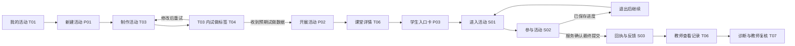

# OpenForm 页面与主流程方案

本方案根据已确认需求起草，并于 2026-10-04 经 `/plan-design-review` 修订。主要功能、页面和交互规则已完成本轮评审；决策按用户此前“后续都按你的建议选择”的授权记录，不代表用户逐页确认视觉，也不代表完成产品实现。过程与证据见 [页面设计评审记录](../reviews/openform-page-design-review-2026-10-04.md)。

2026-10-05 补充：[页面整合方案](openform-page-integration-plan.md)已评审 23 个 HTML 的入口、对象、跨页结果及恢复路径，作为下一阶段整合依据；其中有逐页导航契约、8 项实施任务和20组验收用例。本文保留原页面职责，发生整合问题时以该补充方案为准。页面设计完成、方案评审、实际整合及产品验收分别记录。

## 1. 依据与页面划分原则

- 功能范围以 [正式需求方案](openform-classroom-platform.md) 的 Accepted Scope、D1–D14、权限矩阵及状态约定为准。
- 视觉沿用已确认的 [DESIGN.md](../../DESIGN.md) 与 [VI 规范](../brand/visual-identity.md)。
- [现有预览](../../preview.html) 提供活动列表、制作、诊断、资源、成员、学生参与及组件示例；本稿参考其中的列表、专注制作、统计与证据、移动参与模式，但不把演示导航当成完整产品结构。
- 首版同时覆盖个人空间、校园多用户空间。学校能力不后补；页面按任务复用，权限按当前空间和具体活动决定。
- 优先让教师完成一节课。全局入口放“我的活动”“我的课堂”“我的班级”，制作、诊断和发布从具体对象进入。

评审后保留 **22 个独立业务页面：公共 2、教师 11、校园管理 4、学生 5**，另列 1 个独立运维视图。原 25 个视图中的试做 T04 并入制作器 T03，资源管理 C04 并入资源库 T10，资源交接 C05 并入成员 C01 的操作流程；保留所有已批准功能，减少跨页跳转。

页面数量是组织结果，不是新增功能指标。弹窗、抽屉、页内标签、三种活动样板和各类错误状态不重复计数。编号 G/T/C/S/O 用于设计追踪，与需求实施任务 T1–T10 无关；旧 T04、C04、C05 保留为子视图/流程别名，不再单独计为页面。本稿不固定最终 URL。

### 1.1 四个对象必须能分清

| 对象 | 教师理解 | 页面归属与关键区别 |
|---|---|---|
| 活动 | 一份可以反复使用的教学材料 | T01–T04：草稿、题目、页面、收集内容和版本；没有班级也能制作 |
| 课堂 | 一次具体开展 | T05–T07：使用固定活动版本，有自己的参与者、提交、进度和报告；再次开展创建新课堂 |
| 校内资源 | 同事可发现和复制的已验证活动版本 | T10–T11、C04：复制页面和教学配置，不复制名单、进入码或学生记录 |
| 历史档案 | 从其他空间或实例导入的受限课堂资料 | T12：保留来源，单独查阅；不并入当前学生身份、课堂统计或本人历史 |

教师端与校园管理端是同一工作台按权限呈现的两个工作区域。学生端有独立参与入口，不使用教师侧栏。管理员兼任教师时可以切换工作区域，但管理角色本身不开放学生作答。

## 2. 导航与首页

### 2.1 教师工作台

```text
顶栏：OpenForm ｜ 教学工作台 ｜ 校内资源〔学校空间〕 ｜ 校园管理〔有管理权限〕
                                                 当前空间切换 ｜ 账号菜单

教学工作台侧栏
├─ 我的活动 T01〔默认首页〕
│  └─ 活动详情与版本 T02
│     ├─ 制作活动 T03〔制作 / 试做与检查 T04 两个标签〕
│     ├─ 开展活动 P02 → 课堂详情 T06
│     └─ 协作、发布校内资源、复制或导出〔对象内操作〕
├─ 我的课堂 T05
│  └─ 课堂详情 T06 → 教学诊断 T07
├─ 我的班级 T08
│  └─ 班级详情 T09
└─ 资料迁移与档案 T12〔次级入口〕

校内资源：资源库 T10 → 资源详情 T11 → 复制到当前学校的我的活动
账号/空间菜单：空间设置 G02〔个人设置或有权管理的学校设置〕
```

个人空间隐藏“校内资源”“校园管理”；其拥有者可以维护自己的班级名单、进入码和模型配置。学校空间的教师只看到本人及明确授权的活动、课堂与班级。

教师首页直接进入活动列表；有进行中的课堂时，在列表上方提供紧凑的继续入口。没有活动时展示“描述教学想法”“从样板开始”“导入已有网页”，不要求先建班级或配置学校。

“制作活动”需要草稿上下文，“教学诊断”需要课堂及报告上下文，因此不作为全局侧栏中的孤立页面。返回列表时保留当前空间、筛选和页码。

### 2.2 校园管理

```text
校园管理侧栏
├─ 成员与权限 C01〔管理默认首页；成员详情内含交接流程 C05〕
├─ 班级与任课 C02 → 班级详情 T09〔管理视图〕
├─ 学生名册 C03
├─ 资源管理 → 校内资源库 T10〔管理模式 C04〕 → 资源详情 T11
├─ 模型与额度 G02〔模型标签〕
├─ 空间与数据设置 G02〔基本信息、数据规则标签〕
└─ 运行状态与操作记录 C06
```

纯管理人员登录学校后进入 C01；具备教学角色的人可进入教学工作台。首版不增加独立的学校经营大屏、全校成绩排行或教务首页。

### 2.3 学生入口

```text
活动链接 / 二维码 / 课堂码 → 进入活动 S01 → 参与活动 S02
                                                   ↓
                                          提交回执与反馈 S03
                                                   ├─ 我的记录 S04
                                                   └─ 共享结果 S05〔教师开放时〕

个人进入码验证 → 当前空间内的我的记录 S04 → 获准查看或继续的活动
```

学生无需先浏览门户或注册个人账号。课堂码定位课堂，个人进入码验证学生身份；两者分开命名、分开输入。正在作答时只保留当前活动、保存状态与必要动作，历史和共享结果放在次级入口。

### 2.4 全局上下文

空间切换放在固定位置；切换后重新载入该空间可访问内容，不沿用另一个空间的名单、筛选对象或课堂权限。加入学校不搬移个人资产。需要跨空间迁移时走 T12，并明确源、目标和授权。

教师页面标题中区分活动名称与课堂名称；课堂至少显示所属空间、班级或“快速活动”、负责人和固定版本。学生页只展示参与所需的信息，不带教师后台地址。

## 3. 公共页面

| 编号 / 页面 | 入口与使用者 | 首屏内容 | 主要动作与出口 |
|---|---|---|---|
| G01 登录与加入空间 | 教师/管理登录入口、成员邀请链接 | 产品与部署标识、登录区域；邀请场景显示学校及拟加入身份 | 登录后回到获准访问的目标；接受邀请后进入学校空间；账号创建、验证和找回作为该入口的分支，不新增营销注册流程 |
| G02 空间设置 | 账号菜单；校园管理的配置入口 | 当前空间；按权限展示“基本信息”“模型与额度”“数据规则”标签 | 个人拥有者配置个人空间；学校管理员配置学校空间；保存后显示结果及生效范围，返回原工作区域 |

G01 分三个任务入口：托管教师登录或创建个人账号；已开通学校的成员登录；从学校邀请链接激活并加入。学校首次由服务运营方或校内部署流程开通，首位管理员收到专用激活入口，不要求普通教师自行建学校或购买服务。登录后自动呈现账号实际具备的角色和空间；不让用户自行选择“管理员”取得权限。

认证控件随部署提供的验证方式呈现，工程阶段须固定账号字段、验证和找回机制；页面行为现在固定为保留目标地址、失败保留非秘密输入、过期邀请返回联系管理员入口。学校 SSO 已后置，不预设短信或微信扫码已可用；校内无公网部署须有不依赖外网的验证路径。这些是工程必须落实的规格，不是产品已具备认证的声明。

G02 中模型配置包含已支持的服务类型、连接状态、调用范围、限额与实际使用情况；密钥只在填写/更换时输入，已保存值不回显完整内容。数据规则包含保留期限、导出/删除权限及其影响说明。个人与学校配置分开，不自动使用教师的个人密钥为学校任务付费。普通学校教师在相关生成/分析页面查看可用性和自己获准使用的额度，不获得学校配置编辑权。

## 4. 教师端页面清单

| 编号 / 页面 | 解决的问题 | 首屏信息与主要区块 | 主要动作、入口和出口 |
|---|---|---|---|
| T01 我的活动 | 找到可继续制作或再次使用的活动 | 搜索与类型/状态/归属筛选；活动名称、草稿/版本、最近课堂、更新时间 | 主动作“新建活动”P01；活动进入 T02，草稿可直接到 T03，进行中课堂直接到 T06；协作活动作为筛选，不复制一套列表 |
| T02 活动详情与版本 | 分清材料、版本和历次开展 | 教学目标与来源、当前草稿、已固定版本、试做状态；“版本”“历次课堂”标签 | 按当前状态“继续制作”或“开展活动”P02；进入 T03/T04/T06；页内管理协作 P05、发布资源 P04、复制和导出；查看旧版，不原地改写旧版 |
| T03 制作活动 | 把教学想法、样板或已有网页变成可用草稿并完成试做 | 同一活动上下文下“制作”“试做与检查”两个标签；教学要求、收集内容、规则、学生预览；试做标签含当前修订和实际接收记录 | 生成、修改、保存、切换试做；未通过时回制作标签修正，通过后 P02 开展；模板/HTML 用同一制作器；不建设通用 IDE |
| T05 我的课堂 | 快速找到当前或历史的一次开展 | 接收状态、班级/快速活动、负责人、活动版本、开始时间、参与/完成情况 | 首屏优先进行中课堂；打开 T06；可从已结束课堂发起新一次开展；不把旧课堂“重新开放” |
| T06 课堂详情 | 课中管理接收，课后查看完整结果 | 固定版本与课堂状态；“课堂概览”“参与与记录”“诊断报告”“反馈与共享”标签 | 按状态开放/暂停/恢复接收/结束；展示学生入口 P03；查看记录 P06、图片与进度；进入 T07；导出及有权的数据删除 P10；共享设置 P07 |
| T07 教学诊断 | 依据本次课堂结果决定再讲什么 | 报告选择及固定截止时间；确定性统计、题目/环节表现、开放回答归类、教学建议、实际分析覆盖 | 生成标准诊断或输入自定义分析要求；打开依据 P06、标记教师复核；新数据需生成新报告，旧报告不漂移；回到 T06 |
| T08 我的班级 | 找到有权教学的班级 | 班级名称、人数、任教学科和近期课堂；个人/学校空间上下文 | 打开 T09；个人空间可创建和维护自己的班级；学校教师无任课班级时提示联系管理员，同时仍可开展快速活动 |
| T09 班级详情 | 在名单上下文中开展活动、发放个人码 | 班级信息；“学生名单”“本班课堂”标签；管理视图增加“任课关系” | 有权任课教师选择活动开展、为已有名单学生发码/重置 P08、查看获授权课堂；学校管理员维护名单/任课；个人拥有者维护个人名单 |
| T10 校内资源库 | 找到同事可复用的活动 | 名称、学科/年级/样板类型筛选；作者、固定版本、验证与来源更新状态 | 查看 T11、复制到当前学校的我的活动；空库引导有发布权者从 T02 发布；不混入公共市场 |
| T11 资源详情 | 在复制前判断是否适用 | 教学目标、适用对象、页面预览、收集内容、发布版本、作者与来源 | 主动作“复制到我的活动”P09，完成进入独立草稿 T03；发布者/资源管理员可撤回；源更新时展示新版本，不覆盖既有副本 |
| T12 资料迁移与档案 | 迁移活动材料，受限查阅导入的历史资料 | “导入导出任务”“历史档案”标签；来源/目标、包类型、内容范围、校验及处理结果 | 上传迁移包、预检、确认导入、查看失败原因/重试；下载已获授权的导出；选择档案查看只读记录及图片，不并入本班统计 |

### 4.1 制作与试做

P01 提供三个开始方式：“描述教学想法”“使用样板”“导入已有网页”。三种方式都进入 T03；其中内置样板覆盖随堂测验、词汇/概念闯关、实验探究，不为每个样板另造制作产品。

T03 延续现有预览的浅色专注布局，左侧教学要求和收集内容，右侧学生预览。修改先形成草稿；生成完成只表示已有候选内容，试做有真实接收记录后才显示接入通过。通过标记绑定当前修订，修改后失效。T04 可复用学生运行界面，但明确标为试做，不向正式课堂写数据。

T04 现为 T03 内的“试做与检查”标签，不再独立跳转。活动标题、修订和返回位置保持不变；试做显示页面运行、答案/进度、最终提交及适用图片的实际回执。尚未通过时“开展课堂”不可执行且旁边写明缺少项；不能仅显示灰色按钮让教师猜原因。活动详情 T02 用于版本和历次课堂，不强制插入“继续草稿 → 试做 → 开展”的每一步。

T04 分开呈现“页面运行”“数据接入”“教学内容需教师检查”。需要在校内无公网使用时，还须显示必要依赖检查和断网试做结果；只能联网使用的活动不能被标为校内离线可用。这里的无公网可用要求浏览器仍能连接校内服务；与学生设备断网暂存不是同一种状态。

### 4.2 课堂与诊断

T06 的课堂概览展示已进入、进行中、有效完成和最新接收时间；有名单时另外列未进入名单和全班完成率。快速活动没有名单时只显示实际参与与完成，不推算缺席。

T06 首屏先显示“是否接收、学生从哪进入、目前收到多少”，再显示参与记录。T07 首屏先显示“哪份报告、截止何时、覆盖谁”，然后呈现统计与证据建议。T06 的最新接收时间与 T07 的固定报告截止时间分开命名；存在报告之后的新提交时提示“有新记录，可生成新报告”，不会替换旧报告。P06 打开和返回时保留原结论、筛选及滚动位置。

“参与与记录”按参与身份组织，区分进度、过程记录和最终提交，可展开多次尝试；小组实验由指定记录者提交，小组名称是活动字段，不把一条小组记录计作全组学生完成。

T07 每份报告固定活动版本、数据截止时间和统计口径。首屏同时说明全部参与者、完成/未完成情况、模型实际覆盖及遗漏；不因只分析完成提交而隐藏未完成学生。未答与答错分开，无答案标准不显示正确率，时长不解释为掌握程度。图片可作为证据打开，但首版不声称 AI 已理解图片。

默认按每人最近一次有效完成提交统计题目表现，尝试次数单列；正确率分母是该题有有效作答的人数，未答人数另列。至少一次有效完成提交才计为完成；重试不新增尝试，学生主动重新尝试保留新记录。

报告结论中的“查看依据”打开 P06，并保留回到该结论的位置；没有查看对应原记录的权限时不给出越权预览。数据按授权删除后，相关报告标记失效或引用不可用，不恢复缓存正文。教师复核是确认使用依据，不自动发布下一活动或形成正式成绩。

### 4.3 资源、协作与迁移

活动编辑协作、课堂数据查看、资源发布分别授权。T02 的活动协作入口和 T06 的课堂协作入口使用同一 P05 组件，但操作对象和可授予权限清楚区分。

T11 复制默认留在当前学校空间，并保留资源来源和固定版本；不会因为复制资源就获得源活动编辑权。跨空间迁移通过 T12 显式选择和校验包，不以空间切换自动完成。

T12 把“活动资源包”和“含课堂记录的数据包”分开：前者导入为活动草稿，后者导入为受限历史档案。都先给出可读的预检清单，再确认导入；失败不出现半个可用活动或档案。档案查看需要单独授权，不按学生同名关联，不导入可直接登录的身份和凭据。旧 QuickForm 包仅按已验证的支持清单接入。

## 5. 校园管理端页面清单

| 编号 / 页面 | 解决的问题 | 首屏信息与主要区块 | 主要动作、入口和出口 |
|---|---|---|---|
| C01 成员与权限 | 谁能加入学校、承担什么管理职责 | 成员搜索、邀请/有效/停用状态、角色和已授予范围 | 邀请成员、查看/调整学校管理角色、停用访问；需转移资源时进入 C05；具体课堂协作仍从对象授权，不能用“管理员”概括全部学生数据权限 |
| C02 班级与任课 | 哪些班级存在、由哪些教师授课 | 班级列表、学生数、任课教师/学科；缺少任课关系的提示 | 新建/编辑班级，指定有效成员的任课关系；进入 T09 管理视图或 C03 维护名单；不新增排课和考务 |
| C03 学生名册 | 维护学校内稳定的学生身份 | 学校内部标识、姓名、所属班级、记录状态；区分同名学生 | 建立/维护名单、调整班级关系、处理个人码撤销/重置；换码换班保留同一身份；不展示全校学生答卷或长期能力标签 |
| C06 运行状态与操作记录 | 判断本空间是否能正常开展课堂、追查管理变化 | “运行状态”“操作记录”标签；收集/模型/存储可用情况、任务异常、配额；关键授权、导出、删除、配置、交接记录 | 查看本空间故障和恢复说明，跳回有权处理的配置/任务；无观测数据时显示未知；不展示其他学校数据或学生原文 |

模型与额度、空间基础信息和数据规则使用 G02，不另做一套学校设置页。C06 可以展示获准公开给校方的备份状态和负责人联系方式；整实例备份操作不放在校园管理员通用菜单里。

原 C04 为 T10 的管理模式：增加发布/撤回筛选和授权动作，共用资源详情、版本和数据源；从校园菜单点击时进入同一资源库，不生成另一个副本页面。原 C05 为 C01 成员详情里的分步交接：选择学校资产 → 选择有效接收人及授权 → 预览影响 → 查看结果；管理员只看交接必需的元信息。交接未完成可从该成员重新进入查看实际状态，不新增全局任务中心。

T09 的管理视图只开放管理员有权维护的学生、班级和任课信息。“本班课堂”及回答明细仍按教学授权控制。学校教师可以给获授权名单学生发码，不能据此新建另一套同名身份或看到其他教师的课堂。

成员停用及时撤销访问，不以先完成资源交接为前提；随后由有权管理员处理 C05。需要交接的是学校归属资产，原个人空间继续按个人归属处理。接收人是否仍有效、授权是否可授予在提交时再次核验。

### 5.1 独立运维视图

| 编号 / 页面 | 谁能进入 | 主要内容与动作 |
|---|---|---|
| O01 实例备份与恢复 | 单独授权的部署运维/恢复管理员；托管环境由服务运营方负责 | 查看备份时间点与验证结果、创建受控备份、在干净环境恢复并核对、重新授权后开放；明确可能缺失的时间段及失败状态 |

O01 独立于三个业务端的日常导航。相同人员兼任校管与运维也需分别授权；恢复后不自动启用旧会话、旧个人码和旧成员授权。界面具体形态由工程设计决定，本稿只保留已批准能力的入口和职责，不扩展服务器集群管理。

## 6. 学生端页面清单

| 编号 / 页面 | 解决的问题 | 首屏信息与主要区块 | 主要动作、入口和出口 |
|---|---|---|---|
| S01 进入活动 | 找到正确活动并确认可用身份 | 活动/学校/教师名称、开放状态、参与说明；临时进入或个人码验证 | 活动允许临时参与时开始/恢复同浏览器会话；班级身份通过个人码验证；成功到 S02；独立个人码入口验证后可到 S04 |
| S02 参与活动 | 完成测验、闯关或实验记录 | 当前题目/环节、内容区、作答进度及独立的保存状态 | 作答、保存/自动保存、退出后继续、最终提交；按样板提供图片上传；提交确认后到 S03；开放时可进入 S05 |
| S03 提交回执与反馈 | 明确这次是否已交、何时交、能看到什么反馈 | 已收到的提交时间、所属课堂、尝试记录；教师允许公布的反馈 | 查看本次获准内容、到 S04/S05；课堂允许新尝试且仍接收时返回 S02，产生新尝试而非覆盖旧回执 |
| S04 我的记录 | 找回自己的已保存进度和获准历史 | 当前空间身份；进行中/已完成记录、时间、当前可见范围 | 继续获准且仍可参与的活动、查看历史回执/反馈；稳定身份可跨设备，临时身份只显示当前课堂内该凭据可访问的记录 |
| S05 共享结果 | 查看教师明确开放的课堂内容 | 开放的汇总或筛选内容、适用范围和数据时间 | 阅读获准结果、返回当前活动；教师未开放时不显示入口，直接访问仍核验权限 |

### 6.1 三种活动复用一个参与框架

| 样板 | S02 内容形态 | 需要连续保留的内容 |
|---|---|---|
| 随堂测验 | 题目导航、客观/开放回答、提交 | 当前答案、题目位置和提交尝试 |
| 词汇/概念闯关 | 当前关卡、练习反馈、继续下一关 | 关卡进度、已发生尝试、完成提交 |
| 实验探究 | 参数、观察、结论的分步骤记录，PNG/JPEG 证据 | 步骤内容、数值、就绪图片和最终提交；组记录由指定记录者填写 |

学生界面沿用单列、大题干、大点击区。活动自带的闯关提示与课堂统一公布的结果分开；教师在 T03/T04 检查活动中的即时反馈，在 T06 决定学生可读历史及共享范围。

学校设备共用时提供“退出当前身份”入口，并明确未确认内容仍未交；新使用者不能继承上一位学生的历史。临时凭据丢失后不允许仅凭姓名找回；有稳定身份的学生联系教师重置个人码，原历史仍关联同一学生标识，旧码失效。

### 6.2 学生必须看得懂的接收状态

| 状态 | 页面表达 | 可执行动作 |
|---|---|---|
| 尚未保存 / 正在保存 | 答案仍在编辑或等待服务确认 | 保留输入；避免重复生成提交 |
| 已保存进度 | 显示服务确认时间；尚未计为最终完成 | 可以继续或稍后返回 |
| 本机暂存 / 待确认 | 明确老师尚未确认收到；断网或回执未知 | 恢复连接后查询/重试，不显示“已提交” |
| 图片未就绪 | 显示具体文件及失败原因；文本仍保留 | 重试、移除，或在规则允许时明确改为不含该图的提交 |
| 已提交 | 只有持久化回执后进入 S03 | 查看回执及允许的反馈 |
| 另一设备已有新进度 | 显示冲突，不静默覆盖 | 保留本机内容供查看，重新加载服务端已保存进度后继续 |
| 暂停接收 / 已结束 | 已确认内容可按权限查看，新内容尚未收到 | 暂停时待恢复后再试；结束后不自动补交成功，联系教师安排新课堂 |

图片限制沿用已批准范围：PNG/JPEG，默认单文件 10 MiB、每提交 5 张、长边不超过 4096 像素；页面展示当前部署实际限制。上传成功不等于 AI 已分析图片。

## 7. 对象内操作，不再拆成独立导航页面

| 编号 / 操作 | 位置与形态 | 必要内容与完成去向 |
|---|---|---|
| P01 新建活动 | T01 的开始弹窗/制作器起始态 | 描述目标、选三类样板或导入 HTML；确定当前空间后进入 T03 |
| P02 开展活动 | T02/T03 试做标签/T09 的分步面板 | 首步选“快速活动/班级活动”，次步确认已验证版本、参与范围与反馈；默认立即开放，另可先创建稍后手动开放；成功后固定版本并进入 T06 |
| P03 学生入口卡 | T06 的弹窗/全屏展示 | 学生链接、二维码、课堂码、身份提示、校内网络限制；可复制/下载指引；共享卡不包含个人进入码和管理地址 |
| P04 发布校内资源 | T02 的发布面板 | 选择有发布权且已验证的版本、学科/年级标签及说明；明确不包含学生数据；固定发布版本后进入 T11 |
| P05 协作授权 | T02/T06 的对象权限抽屉 | 选择本校有效成员、明确编辑/发布或课堂查看/管理等权限；仅能授予自身可授权范围，撤销后立即更新可访问状态 |
| P06 记录与分析依据 | T06/T07 的详情抽屉，窄屏可全屏 | 来源课堂、参与者、尝试、题目/环节、原始内容及获准图片；保留报告返回位置，不扩展全校学生画像 |
| P07 反馈与共享设置 | T06 的页内表单 | 本人历史/反馈与共享结果分开；共享默认关闭；选择汇总或明确筛选内容，预览学生可见范围后开放；撤回后隐藏 S05 入口并拒绝新读取，不承诺收回已看过/下载的内容 |
| P08 个人码发放与重置 | T09/C03 的授权面板 | 确认空间、名单条目、身份与用途；生成/发放、撤销/重置结果；名单列表不常驻展示完整个人码 |
| P09 复制资源 | T11/T10 的确认面板 | 当前学校空间、源版本、新名称；说明不含学生记录；成功到 T03，失败不出现可用半成品 |
| P10 导出或删除课堂数据 | T06 的受权操作面板 | 明确课堂、记录/图片范围与影响；导出进入 T12 任务，删除后更新记录和相关报告可用性；仅有查看权不能自动导出/删除 |

后台处理状态回到发起的活动、课堂、报告或迁移任务中查看。首版不新增独立通知中心、自动邮件发送、审批流、消息聊天或通用任务看板。

### 7.1 开展与进入的默认路径

快速活动默认临时参与，学生从共享入口直接开始，不要求建班或注册。需要跨设备时，教师可显式选择当前空间内其有权使用的既有名单身份并发个人码；没有名单不承诺学生级历史。班级活动默认验证个人码，并在发布前显示具体班级及参与范围，不让学生输入姓名自行匹配名单。

S01 根据课堂设定只呈现适用动作：临时新参与“开始活动”、已有本浏览器进度“继续活动”、稳定身份“验证个人码并进入”。课堂码只定位活动；输入错类型给出明确纠正，不把登录教师后台作为兜底。学生更换空间或退出身份时清理上一身份可见内容，再验证新身份。

P02 提交处理中保持同一请求，不重复创建课堂；未知结果先查询该次创建结果，不能连续点击得到多个入口。关闭面板不隐瞒已完成创建，返回 T05 可找到该课堂。活动准备/开放状态必须与入口卡一致。

## 8. 核心操作流程

### 8.1 教师从想法到第一次课堂



快速活动跳过建班和名单；班级活动需选择有任课/对应授权的班级。首次成功标准是教师能看到真实收到的结果、学生能分清保存与提交，而不是打开了所有页面。

### 8.2 校园从名单到多教师开课

1. 管理员经 G01 进入 C01，邀请教师并确认成员有效。
2. 在 C02/C03 建立班级、稳定学生名单及任课关系；G02 配置可用模型和限额，不依赖教师个人密钥。
3. 教师进入学校工作台 T08/T09，只看到自己的任课范围；给名单学生发放 P08 个人码。
4. 教师使用 T01–T04 制作，或 T10/T11 复制资源；通过 P02 为班级开展课堂。
5. 学生从 S01 进入，凭同一稳定身份在其他设备续做；T06/T07 仅向有权教师开放记录。
6. 管理员在 C06 看运行状况，不因配置了班级和模型就获得全部答卷。

### 8.3 学生退出继续、查看历史与共享

1. 临时参与：S01 获取当前课堂凭据 → S02 保存 → 同浏览器再次打开原链接恢复；清理凭据后不凭姓名认领。
2. 稳定身份：S01 验证个人码 → S02 保存 → 换设备验证同一身份后继续；换码保留历史，旧码失效。
3. 最终提交收到回执后进入 S03；未获回执停留在待确认状态，不创建假成功记录。
4. S04 仅列当前空间获准记录；S05 仅在教师已开放且当前参与身份有权时可用。

### 8.4 课堂结果转为教学判断

T06 查看参与及完成 → 打开原始作答/图片 P06 → 生成标准或自定义诊断 T07 → 看实际覆盖与遗漏 → 打开结论依据 P06 → 教师复核。模型不可用时，T06 的原始数据、规则统计与导出仍可使用；下一次活动由教师回到 T02/T03 决定。

### 8.5 校内复用与人员交接

活动拥有者在 T02 用 P04 发布验证版本 → 同校教师 T10 搜索 → T11 查看并复制 → 独立草稿 T03 → T04 试做 → P02 开展自己的课堂。源作者修改不改变副本，撤回资源不删除已经复制的活动。

成员离岗时 C01 停用访问 → C05 选择学校资产与有效接收人 → 查看交接结果；新负责人可按授予范围继续维护，历史作者和既有课堂版本不改写。

### 8.6 迁移与恢复分别处理

- 资源迁移：源空间授权导出 → 目标空间 T12 预检 → 确认内容/新标识 → 生成草稿 T03 → T04 重新检查接入后开展。
- 课堂资料迁移：含数据包预检 → 权限核验 → 导入 T12 的受限历史档案；不进入目标学生 S04，不进入当前课堂 T06 的统计。
- 实例恢复：独立运维人员 O01 在干净环境恢复 → 核对记录、文件和归属 → 重新授权/签发凭据 → 开放服务；不把旧权限直接恢复为有效。

## 9. 主要页面状态与权限约束

以下五态是实现与原型的必做规格。成功须以实际保存、回执或结果为依据；未开始操作不是失败，未知数据不显示为零。

| 页面/功能 | 加载/等待 | 空态 | 错误与恢复 | 成功 | 部分/受限状态 |
|---|---|---|---|---|---|
| G01 登录/加入 | 显示正在验证，保留目标页面 | 首次使用选择个人账号或学校邀请入口 | 凭据错误可重试，邀请失效联系管理员；不泄露账号是否存在的敏感细节 | 按真实角色进入目标或默认首页 | 已登录但学校成员未激活，显示当前状态与可用个人空间 |
| G02 配置 | 读取/保存中，保留原可用设置 | 未配置模型提示有权人员设置 | 保存失败保留非秘密输入；连接失败不伪报可用 | 显示生效范围和保存结果 | 模型可配置但不可达/额度耗尽；收集服务仍可用 |
| T01 活动列表 | 保留框架和筛选，列表加载 | 无活动提供 P01；搜索无结果提供清空筛选 | 查询失败可重试，不当作活动被删除 | 返回可访问活动及草稿/课堂入口 | 有活动但无编辑权显示只读及原因 |
| T02 版本详情 | 读取版本/课堂关系 | 尚无发布版本，可继续制作 | 版本撤权或不可用，返回活动列表 | 可查看固定版本、来源及历次课堂 | 旧版本仍可查，最新草稿尚待验证 |
| T03 生成/修改 | 排队/处理中，原草稿仍可读；不编百分比 | 三种开始方式、教学目标示例 | 保留要求和原稿；冲突不覆盖，重载后再改 | 候选草稿可预览和试做，不宣称教学正确 | 内容可运行但收集说明或接入未通过 |
| T04 试做标签 | 试做等待真实接收 | 未试做说明需要哪些行为 | 定位没收到的答案/进度/图片，返回制作标签 | 当前修订实际接收验证通过，开放 P02 | 部分行为收到、部分未收到；不能整体打勾 |
| T05 课堂列表 | 读取时保留状态筛选 | 无课堂可从已有活动开展 | 失败重试，保留已知列表并注明时间 | 进行中优先，打开具体课堂 | 已准备未开放与接收暂停分开 |
| T06 课堂详情 | 显示接收状态查询中，最近更新时间 | 无提交显示 P03，不生成全错结论 | 接收状态变更失败保留实际原状态；查询失败不编人数 | 实际参与和提交可查、图片按权限打开 | 无名单不推算缺席；部分人进行中，尚未全部完成 |
| T07 报告 | 排队/分析中，仍能回 T06 看原始统计 | 无可分析记录不调用模型编造 | 失败/无效依据明确标记，可创建新任务 | 固定快照、有效引用、复核状态可查 | 覆盖数量、遗漏和未完成学生分开；旧依据删除后报告失效 |
| T08/T09 班级 | 名单/课堂分别加载 | 无班级/任课由有权人员处理，可快速开课 | 名单/任课无权只读或返回，不按同名合并 | 有权范围内开课、发码、查看记录 | 已建学生未分班、已建班未任课分别提示 |
| T10/T11 资源与 C04 模式 | 读取/复制中 | 空库引导发布，搜索空可清筛选 | 源撤回或失权拒绝新复制；失败可重试 | 独立草稿及来源可见，成功后到制作器 | 来源有新版本但现有副本不更新 |
| T12 迁移/档案 | 预检/处理/导出等待；可关闭后回来 | 无任务提供迁移入口，无档案说明用途 | 坏包/无权整体失败，可查看原因；不留可用半成品 | 资源成为草稿，数据成为受限档案 | 文件待就绪、旧包仅部分协议支持时不得伪报完整导入 |
| C01 成员与 C05 交接 | 邀请创建/授权变更/交接等待 | 没有成员显示邀请；没有待交接资产明确无须转移 | 接收人失效或失权保持原归属；停用可先完成 | 成员状态/负责人实际变更可见 | 邀请未接受不是有效成员；停用后仍待处理资产可见 |
| C02/C03 班级任课与学生 | 读取/提交名单变更 | 无班级、学生、任课分别提供对应入口 | 校验失败定位字段；同名不能自动合并 | 稳定学生标识不变，班级/任课更新 | 名单和任课尚未齐全，不宣称班级可按名单开展 |
| C06 运行与记录 | 读取当前空间状态 | 无观测数据显示未知；无操作记录是合法空集合 | 故障提示影响及处理入口，不展示原始学生内容 | 可追踪管理变化及有权观察的运行状态 | 模型故障与提交故障、存储告警分开 |
| S01 进入 | 读取课堂、验证身份或恢复进度 | 临时首次参与可直接开始 | 码错误/过期/身份失效给重试或联系教师入口 | 定位到本人在本课堂的进度 | 暂停/结束可按权限读旧内容，不能新写入 |
| S02 保存/提交 | 显示保存中/提交待确认 | 首题/首步，未作答不算错误答案 | 断网暂存、冲突、图片失败分别处理，保留未确认输入 | 已保存与最终提交明确分开；最终回执才到 S03 | 部分图片未就绪不显示完整提交；重试不增尝试 |
| S03 回执 | 查询原请求状态，不能先画成功页 | 尚无回执返回待确认状态 | 查询失败继续提示待确认 | 显示真实提交时间与尝试，按权限展示反馈 | 已提交但教师未开放答案，不影响提交成立 |
| S04 本人记录 | 当前空间身份验证和记录加载 | 无获准记录说明范围 | 失权回入口并清理旧展示，不靠姓名找回 | 继续允许参与的记录或查看允许的历史 | 临时身份只限本课堂；部分历史已结束/撤回访问 |
| S05 共享结果 | 核验权限并加载教师开放内容 | 已开放但暂无内容，与未开放区分 | 撤回/失权立即停止读取并返回活动 | 显示授权汇总/筛选内容及时间 | 只覆盖公布范围，不暗示全班原始数据 |
| O01 运维恢复 | 准备、验证、待重新授权分别呈现 | 尚无备份不能宣称可恢复 | 校验失败保留原服务环境，说明可用恢复点 | 核对完成、重授权后才允许开放 | 恢复未覆盖时段和暂停授权必须可见 |

对象操作 P01–P10 复用对应页面状态，并补以下结束条件：P02 创建成功后返回可找到的课堂；P03 复制/下载入口成功不等于学生已进入；P04/P09 发布/复制固定版本后才显示成功；P05/P08 授权或换码以实际生效为准；P06 加载失败不显示过期原文；P07 先预览公开范围再生效；P10 导出就绪才提供下载，删除前说明影响并按实际结果更新引用。

未保存草稿、设置、未提交表单离开时提供“继续编辑 / 放弃未保存更改”，可保存的场景另有“保存后离开”；已在服务端运行的生成、分析、导出不因关页消失，回来可在来源对象找到任务结果。主动重新尝试与网络重试分开命名。失权时停止展示受限内容，不能为了保留输入泄露前一身份的作答。

权限以服务端核验结果为准。隐藏按钮、切换角色或知道链接都不能代替授权；记录、图片、下载、报告、档案沿用同一对象权限。

## 10. 已确认需求覆盖检查

| 需求 | 主要承载页面/操作 | 本稿覆盖点 |
|---|---|---|
| D1 / D8 共享核心、个人与学校 | G01/G02、全部工作台、C01–C06 | 空间切换、角色差异、名单任课、明确协作与交接 |
| D3 生成、修改、HTML 接入 | T01–T04、P01 | 三种开始方式、统一制作、真实试做与修订绑定 |
| D4 学生进入指引卡 | T06、P03、S01 | 链接/二维码/课堂码、网络说明，与个人码分开 |
| D6 保存恢复、本人历史、共享读取 | T06/P07、S01–S05 | 临时与稳定身份、保存/提交分离、获准历史与共享 |
| D7 标准诊断与自定义分析 | T06/T07、P06 | 规则统计、固定快照、实际覆盖、结论依据、教师复核 |
| D8 校园多用户、资源协作 | C01–C06、T08–T11、P04/P05/P08 | 成员、班级任课、稳定名单、资源发布发现复制、分开授权 |
| D9 快速/班级两种开展 | P02、T06/T09、S01/S04 | 无名单可开课，个人码支持跨设备，临时记录不按名认领 |
| D10 托管与校内部署 | G01/G02、T04、P03、C06、O01 | 网络可用范围、模型降级、独立运维备份恢复入口 |
| D11 三样板、有限材料范围 | T03/T04、S02、T06/P06 | 测验、闯关、实验；文本/数值/结构化答案和图片证据 |
| D12 版本、复制与迁移 | T02/T11/T12、P02/P04/P09 | 固定版本、独立副本、资源/数据包分开、受限档案 |
| D13 先完整链路再试点 | 第 8 节流程、第 11 节原型顺序 | 先跑通完整课堂，同时验证两位教师隔离和复用；不另造“试点管理系统” |
| D14 模型配置与限额任务 | G02、T03/T07、C06 | 配置、额度、排队与失败可见；学生端无直接模型调用入口 |

D2 是评审模式，不生成产品页面；D5 手机电脑并排预览已撤下，不借本稿重新纳入。独立教师安装包、学校 SSO、多模态自动分析、公共市场、家长端、排课考务、多人实时共同编辑等仍不在首版。

## 11. 与现有预览的衔接及下一轮原型顺序

| 现有预览 | 本稿对应 | 后续调整方向 |
|---|---|---|
| `#activities` | T01 | 保留列表风格；进入 T02，并提供到具体课堂的入口 |
| `#editor` | T03 | 保留专注制作布局；补三种开始方式和 T04 的真实业务方案 |
| `#diagnosis` | T06 / T07 | 把课堂实时管理与固定快照报告分开；复用统计、证据和复核样式 |
| `#library` | T10 / T11 / C04 | 保留紧凑筛选；补资源详情及按权限出现的管理操作 |
| `#members` | C01 | 保留成员表格；补与班级、任课、学生名单和交接的关系 |
| `#student` | S02 | 保留单列答题；补 S01、S03–S05 及身份/保存边界 |
| `#system`、`brand.html` | 设计参考 | 保留为设计资产入口，不进入真实产品主导航 |

建议原型顺序如下，表示设计制作先后，不减少首版需求或将校园能力后置到第二版：

1. **完整一节课**：G01、T01–T07、P01–P03、P06–P07、S01–S04。以词汇闯关走通制作、试做、开展、继续、提交和诊断；同时呈现个人/学校上下文。
2. **校园多人使用与复用**：T08–T11、C01–C05、P04–P05、P08–P09、S05。用同校两位教师演示名单、任课、授权、复制及相互不可越权；补测验和实验内容形态。
3. **首版交付管理**：G02、T12、C06、P10、O01。补齐模型与额度、迁移、保留与删除、运行状态、备份恢复；这些仍是首版交付必需范围。

## 12. 首屏层级与组件复用

每页先让用户知道当前对象和状态，再呈现完成任务所需内容，最后放低频配置。单页只保留一个主要动作；“开展课堂”在当前修订未通过检查时不可执行，并展示具体原因。

| 页面族 | 第一眼 | 第二层 | 第三层 / 主动作 |
|---|---|---|---|
| G01/G02 | 当前进入目标 / 当前设置空间 | 验证或配置表单、具体状态 | 帮助和影响说明；登录/保存 |
| T01/T02/T05 | 活动或课堂名称及状态 | 列表、草稿、固定版本、历次开展 | 筛选/更多操作；新建/继续/开展随状态择一 |
| T03/T04 | 当前活动与修订、制作/试做标签 | 教学要求和活动预览 / 实际接收核对 | 数据说明和修改记录；生成或试做，检查通过后开展 |
| T06 | 接收状态、学生入口、实时参与 | 学生及尝试/进度/提交 | 历史报告、共享配置、导出 |
| T07 | 固定截止、版本、实际覆盖 | 规则统计与有依据的归纳 | 复核与新报告；回到来源课堂 |
| T08/T09/C02/C03 | 班级/学生与授权上下文 | 名单、任课、课堂关系 | 发码/名单维护等按角色出现 |
| T10/T11/C04 | 主题、适用对象、版本 | 页面预览、收集内容及来源 | 复制；发布/撤回仅在有权时出现 |
| T12 | 源、目标及包类型 | 预检清单/任务/受限档案 | 导入或下载，不混入当前课堂结果 |
| C01/C05/C06/O01 | 管理对象及真实状态 | 影响范围、可处理问题 | 授权变更、交接或恢复的确认 |
| S01/S02 | 哪个活动、我是谁 / 当前题目 | 输入、作答和保存状态 | 开始/继续/提交；记录和共享为次级 |
| S03/S04/S05 | 是否已交 / 本人或公开范围 | 回执、历史或已开放结果 | 下一项可做动作，不强推注册或成绩排行 |

| 组合 | 沿用 token / 组件 | 新增约定 |
|---|---|---|
| 教师/校园框架 | `{colors.canvas}`、`{components.topbar}`、`{components.sidebar}`、`{typography.body}` | 首屏给任务内容，保留当前空间及清楚返回路径 |
| 制作与试做标签 | `{colors.primary-soft}`、`{colors.primary-strong}`、`{rounded.control}`、面板 | 同一活动上下文，不复制编辑器；选中除颜色外有下划线/文字状态 |
| 课堂快照/覆盖条 | `{components.metric-strip}`、`{colors.text-secondary}`、语义标签 | 实时接收时间与报告固定截止用不同字段名；不混用数字 |
| 证据和交接面板 | `{components.drawer}`、`{components.dialog}`、`{rounded.overlay}` | 复杂交接分步骤，证据有返回结论动作；窄屏全屏可滚动 |
| 学生进入与回执 | `{typography.student-body}`、`{typography.student-question}`、`{components.student-action}` | 16px 正文、22px 题干、48px 主动作；回执须真实确认 |
| 品牌及信息提示 | `{components.brand-logo}`、`{components.brand-symbol}`、`{colors.warning}` 等 | 使用正式 SVG；校名独立显示，不重新绘制学校版 Logo |

教师桌面保持已确认的 14px 正文和 13px 表格，不用营销页规则重写字体。学生及移动表单至少 16px。正文/状态文字目标对比度不低于 4.5:1；颜色不独自承担状态含义。普通内容链接有下划线及访问后区别，操作导航以当前项表达位置。焦点、选区、输入光标使用现有强调色；不通过装饰动效掩盖真实处理状态。

## 13. 用户旅程故事板

“感受”是待试点验证的设计假设，不是已访谈结论。

| 角色 / 步骤 | 用户做什么 | 可能感受 | 页面如何支持 |
|---|---|---|---|
| 教师首次到达 | 找到做活动的地方 | 不想先学复杂后台 | T01 直接给三种开始方式，快速课堂无需建班 |
| 教师制作 | 描述目标、修改题目 | 想知道生成是否可用 | T03 看预览、收集说明，失败保留原稿 |
| 教师试做 | 完成一次并核对结果 | 担心学生交了自己收不到 | 同一制作器 T04 显示实际回执，未通过不给开课成功暗示 |
| 教师开展 | 选快速/班级并发入口 | 课前时间紧 | P02 有默认路径，P03 能投影或下载，固定使用版本 |
| 学生到达 | 找到活动并进入 | 不知道课堂码和个人码区别 | S01 只显示适用入口，活动定位和身份验证分开 |
| 学生参与 | 回答、退出再回来 | 担心答案丢失 | S02 单独显示已保存、暂存、提交；稳定身份可续做 |
| 学生提交 | 等待老师收到 | 需要明确完成感 | S03 只有真实回执才成功，反馈未开放与未提交分开 |
| 教师看结果 | 找到未完成与常见问题 | 想迅速决定怎么讲 | T06 先真实参与，T07 给固定覆盖和可回查依据 |
| 教师再次使用 | 复制、改题、再开课 | 希望积累而非从头做 | T02/T10/T11 保留来源和旧课堂，复制成为独立草稿 |
| 校管开通 | 配置成员、名单、任课 | 担心授权错误 | G01 明确首校管入口，C01/C02/C03 按对象组织 |
| 校管交接 | 停用离岗成员并转交学校资产 | 担心停用导致资产消失 | 成员内 C05 保留影响预览和历史作者，不等交接才停权 |
| 校内故障 | 判断什么还能用 | 需要知道能否继续上课 | C06 区分模型和收集故障；O01 由独立运维恢复 |

5 秒：看清当前活动、空间和下一步；5 分钟：从创建到试做/进入过程不迷路；长期反复使用：保留版本、来源、回执和可复核的教学依据，而非积累不可解释的报告。

## 14. 响应式与无障碍规则

| 页面族 | 桌面 ≥1280px | 平板 768–1279px | 手机 <768px |
|---|---|---|---|
| 工作台/校园导航 | 60px 顶栏、240px 侧栏，当前对象面包屑 | 64px 图标侧栏，图标有可访问名称 | 可展开导航保留当前模块和返回，切换空间独立可见；不能只隐藏入口 |
| 活动/课堂/成员/资源列表 | 紧凑筛选和表格 | 主要筛选保留，次要筛选折叠 | 名称、状态、主动作优先；详情列可容器内横滚或展开，不整页溢出；不靠 hover 才出现操作 |
| T03 制作/试做 | 要求/检查与预览分栏 | 可调为“编辑内容 / 查看预览”页内切换，保留修订 | 一次展示一个工作区域；试做优先显示活动，接收摘要就近查看；不把两个长栏简单上下堆叠 |
| T06/T07 结果报告 | 参与摘要、表格、统计/归纳按任务分区 | 摘要换行；数据和归纳保持顺序 | 先接收或快照范围，再关键结果；证据全屏阅读，可返回原结论 |
| G02/交接/迁移/恢复 | 标签和分步骤表单 | 标签可滚动，表单保留标签 | 单列分步；确认页显示影响对象，长清单局部滚动，取消/返回可触达 |
| S01–S05 | 单列最大宽度使用 `{components.student-container}` | 同一单列和大点击区 | 320/390px 均完整可读；键盘弹起时输入及当前动作可滚入可见区；固定操作条不得盖住题目、错误或最后选项 |

键盘：页面提供跳过导航到主内容；语义化 header/nav/main、一个主标题；按钮可用 Enter/Space，表单标签常驻。页内标签用方向键/Home/End 选择，选中和焦点分开，切换不丢未保存草稿。弹层进入时焦点落在标题或第一项，Tab 留在弹层，Escape 按可取消状态关闭，结束后回原触发点；有未保存输入先走离开确认。

反馈：普通保存/处理状态通过礼貌的 live region 播报，阻断提交的错误关联字段并定位第一处错误；不每次刷新人数就打断读屏。作答选择以原生单选或等效键盘语义提供；图片上传有可访问名称、错误和替代说明。状态均有文字，焦点明显；缩放到 200% 仍能完成主要操作。

触控界面交互目标至少 44px，学生主动作沿用 48px、选项 56px；桌面 32px 控件规则保留，触控条件下扩大点击区域或高度。非必要过渡尊重减少动态效果，页面内容不依赖动画后才出现。实际辅助技术与设备验证见实施任务，不以文档规则代替通过证据。

## 15. What already exists

已确认 `DESIGN.md`、品牌路径 SVG 与共享颜色、教师表格/筛选、浅色专注制作、规则统计/证据抽屉、校园成员列表和学生单列原型。复用上述至少六种模式，不复制 AdPilot 业务代码，也不新增视觉体系。

首轮 HTML 结构线框位于 `/Users/sjs/.gstack/projects/openform/designs/page-review-20261004/review-wireframes.html`，含六个核心视图。它们核对页面关系和信息层级，不是用户逐页批准的成品；当轮 AI 设计器缺少 key，AI 图稿生成数为 0。此后已逐页完成22个业务页面及O01的独立HTML，见[23页索引](../prototypes/html-page-index-20261004.md)；完整对象/跨角色整合仍待实施，按[补充整合方案](openform-page-integration-plan.md)推进。`preview.html` 保留为早期七页风格样例。

## 16. NOT in scope

1. 新视觉方向、全套 Logo 重做：沿用已确认 UI/VI。
2. 公共市场、家长端、排课考务、全校成绩与长期画像：超出课堂主线。
3. 同步多人编辑、SSO、多模态自动分析和独立教师安装包：保留原后置范围。
4. 自助购买、建校认证、通用通知中心：本次只定义使用已开通学校的入口。
5. 产品实现、线上数据操作、部署和真实课堂验收：本轮为方案评审；必需实现和验证纳入任务，不列为可选债务。

## 17. Implementation Tasks

以下均待实施，由本次 R1–R10 发现导出，接续 CEO T1–T10，不重复创建独立产品范围。路径为工程候选目录，尚无应用代码；投入为相对规模（人工团队 / Codex），工程评审再拆工期。

- [ ] **UI1（P1，M / M）活动制作与开展**：落实 T03/T04 合并、修订验证门槛与 P02 固定版本。
  - 来源：R1、R5；候选 `apps/web/authoring`、`apps/web/classroom`。
  - 验证：生成/导入 → 试做收到真实数据 → 修改后验证失效 → 固定版本开展；返回修改不丢草稿，旧课堂不变。
- [ ] **UI2（P1，M / M）校园资源与交接**：同一资源库按权限展示管理；成员内完成交接。
  - 来源：R2、R3；候选 `apps/web/library`、`apps/web/school`。
  - 验证：两个教师复制独立，源撤回不删副本；停用立即失权，失败交接不改归属，管理员不能读取答卷。
- [ ] **UI3（P1，M / M）首次进入与参与身份**：落实 G01 开通/邀请返回、P02 与 S01 的默认参与路径。
  - 来源：R4、R5；候选 `apps/web/auth`、`apps/runtime/entry`、`services/api/identity`。
  - 验证：个人首次使用无需建校；首校管与邀请教师可进入；临时不要求注册，个人码可跨设备；错误码、失效邀请和无外网校内入口可恢复。
- [ ] **UI4（P1，M / M）实时课堂、固定报告与共享**：落实 T06/T07 区分及 P07 默认关闭/预览/开放。
  - 来源：R6、R8；候选 `apps/web/classroom`、`apps/web/analytics`、`apps/runtime/results`。
  - 验证：报告后新提交不改旧报告；依据可回原文；共享前不可读，撤回后停止新读取；未完成和未覆盖不被隐藏。
- [ ] **UI5（P1，L / M–L）状态与任务恢复**：实现第 9 节五态、未保存离开、后台任务返回及无回执语义。
  - 来源：R7；候选 `apps/web`、`apps/runtime`、`services/api/data`。
  - 验证：断网、回执丢失、图片失败、额度不足、权限撤销、修订冲突均有明确出口；重复动作不多建课堂/提交，不泄露前一身份内容。
- [ ] **UI6（P2，M / S–M）组件与完整原型**：按第 12 节复用 token/组件，补齐 22 页及对象操作，保留六个核心线框的主次结构。
  - 来源：R9；候选 `apps/web/components`、`apps/runtime/components`，原型按 gstack 设计目录规范保存。
  - 验证：全部页面沿用正式资产和密度；成功状态有真实依据；页面/返回导航有对应对象，无装饰卡片替代任务区。
- [ ] **UI7（P1，M / M）响应式与可访问性**：落实第 14 节页面族行为、键盘、焦点和状态播报。
  - 来源：R10；候选 `apps/web`、`apps/runtime`、`tests/e2e`。
  - 验证：1440/1024/768/390/320px、200% 缩放、触控和键盘完成主流程；证据返回、表单错误和弹层无焦点丢失；真实手机及读屏检查并记录结果。

Pass 3 的故事板是既有路径表达，不另造实施任务；Pass 4 未发现新视觉方向问题，无新增任务。无新增延后 TODO。结构化清单见 [design-review-tasks.jsonl](../planning/design-review-tasks.jsonl)。

## GSTACK REVIEW REPORT

| Review | Trigger | Why | Runs | Status | Findings |
|---|---|---|---|---|---|
| CEO Review | `/plan-ceo-review` | 已确认功能范围 | 1（需求文档记录） | 已完成；不代表实现 | 11 项主范围采纳、3 项后置；原记录 commit unknown |
| Design Review | `/plan-design-review` | 本页面方案及补充整合方案 | 2 | clean（方案决策） | 首轮10项；本次补充8项，最低5→8；23个独立HTML已有，整合待做；详见补充方案末尾报告 |
| Outside Review | Claude Code / design voices | 可选独立意见 | 0 | disabled | 沿用关闭配置；无外部或独立子代理覆盖 |
| Eng Review | `/plan-eng-review` | 架构、数据、权限与验证 | 0 | 未进行，required | UI1–UI7 与 CEO 任务需合并拆解；技术路径未验证 |
| DX Review | `/plan-devex-review` | 开发接入体验 | 0 | 未进行 | 不冒充本次设计覆盖 |

**OUTSIDE COVERAGE:** host=codex；outside_provider=claude-code；phase=design；outside_status=disabled。HTML 线框由主笔制作/检查，不构成跨模型验证。

**VERDICT:** 页面职责及补充整合方案已完成七项评审，主要功能决策已写入；下一步为工程评审与页面整合。状态为 DONE_WITH_CONCERNS：23个独立HTML已设计，统一视觉确认、完整整合、真实设备/辅助技术、应用运行与课堂验收仍待完成；这些已纳入必做任务，不是已通过测试。最低分8来自响应/可访问性，不能把方案clean解读为产品可上线；eng review required。

NO UNRESOLVED DECISIONS
