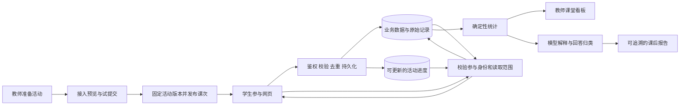

# QuickForm 研究与 OpenForm 课堂版重做建议

研究日期：2026-10-04。用户已选择“教师与学校，先做好课堂场景”，并进一步明确同时需要教师版和多用户校园版。OpenForm 为本文暂用名称，并非已确认品牌。

CEO 评审进展：D1 已确认新建共享核心，参考并按需兼容 QuickForm；D2 已选择扩展范围模式；D3 已确认纳入平台内生成和修改单页互动网页，保留外部导入，并要求真实试做验证、修改预览及确认发布；D4 已确认纳入学生进入指引卡；D6 已确认首版支持保存恢复进度、本人历史及授权共享结果。其余新增能力仍逐项确认，下文未明确批准的详细功能和技术选型仍为建议；进度见 `docs/reviews/openform-ceo-review-2026-10-04.md`。

后续决定：D7 已明确选择教学诊断与建议；用户授权后续按推荐方案选择。已选择完整校园协作、临时与班级活动双入口、托管及校内部署、三个首发活动样板、版本与迁移及模型配置边界。下文是研究与建议的演进记录，最终范围已在 [正式方案](../designs/openform-classroom-platform.md) 汇总；不把技术栈建议或容量目标视作运行验收。

评审重点修正：按用户最新要求，优先评审活动生成与修改、发布参与、数据采集与交互、结果分析、校园多用户及部署交付；预览布局等体验细节不再逐项询问。已有批准继续有效，尚未选择的细节不自动纳入。

## 1. 结论与证据范围

QuickForm 解决的是：教师通过 AI 做出了交互网页，却缺少一个方便的数据后台，无法把学生的操作结果汇总起来。其核心价值是降低“交互网页从演示作品变成教学工具”的门槛。

建议继承它的开放网页接入方式，围绕“准备活动—验证接入—发布课堂—观察参与—分析结果—下次复用”重新设计产品。首轮可交付范围同时包含教师个人使用和校园多用户使用：既验证教师能否独立、可靠地用完一节课，也验证学校内多位教师并行教学、资源共享和权限隔离。

建议两版共用一套代码、活动协议和数据模型，通过个人空间与学校空间提供不同的管理体验。多用户和空间隔离从第一版建立，避免在单用户产品完成后再改造数据归属。

本次读取了官网、故事、使用指南、接口文档，以及 GitHub 公开教师版 2.5 的核心源码、配置和依赖。源码固定于提交 `4854a4db511690346112499d3b4500334547995e`。没有登录官网后台，没有向真实任务提交数据，没有运行或压测原项目。文档声明、源码行为和下文建议分别标注；源码发现不自动代表在线版实现。

## 2. 它主要解决什么问题

以英语词汇闯关为例：AI 可以生成配对、计时、计分页面；教师还需要知道哪些学生参与、哪些词易错、课堂是否可以进入下一环节。这要求网页主动提交相应数据，并有统一的接收、保存和查询服务。

QuickForm 为每个任务生成专属接口，让 AI 生成的页面向其提交数据，再由后台或另一个页面读取。它可以承接测验，也可以承接实验、游戏、互动阅读等自定义活动。[官方故事](https://quickform.readthedocs.io/zh-cn/latest/about/story.html)、[工作原理](https://quickform.readthedocs.io/zh-cn/latest/guide/2.principle.html)

| 教师遇到的问题 | QuickForm 提供的机制 | 带来的价值 |
|---|---|---|
| 有网页，缺少后端 | 每个任务一个 HTTP 数据入口 | 不必为每个活动重新开发服务端 |
| 学生结果分散在浏览器 | 提交记录集中保存、查看和导出 | 可以汇总课堂结果 |
| 普通题型难以表达教学活动 | 页面可由外部 AI 或开发工具生成 | 保留交互设计自由 |
| 结果难以理解 | 接模型分析，或生成读取接口的数据看板 | 缩短数据整理过程 |
| 公网或学校网络不适配 | 教师版、校园版与任务迁移 | 允许在本地环境运行 |

后两项分别见[分析指南](https://quickform.readthedocs.io/zh-cn/latest/guide/4.upgrade%E2%80%8C.html)和[部署指南](https://quickform.readthedocs.io/zh-cn/latest/guide/deploy.html)。

需要准确理解能力边界：接入接口并不会自动记录每一次点击。只有网页代码明确提交的事件和字段才会被收集；收到了数据也不代表已识别真实学生，更不代表能直接推断知识掌握程度。

## 3. 它是怎么解决的

### 3.1 产品流程

官方入门流程可以概括为：创建任务获取接口 → 告诉 AI 将网页数据提交到该接口 → 分享或上传网页 → 查看记录、导出或分析。[入门教程](https://quickform.readthedocs.io/zh-cn/latest/guide/1.start.html)

官网已经提供网页托管、项目案例和 QFLink 入口；CLI 文档还覆盖任务创建、查询、网页上传和任务包导出。因此，“提供 API”“增加命令行”“云端任务搬到本地”本身不足以构成新产品差异。[官网](https://quickform.cn/)、[CLI 接口](https://quickform.cn/cli)

### 3.2 公开教师版的实现

| 层次 | 核实到的实现 | 对重做的启示 |
|---|---|---|
| Web 服务 | Python、Flask，模板页面 | 核心服务可以保持简单 |
| 持久化 | SQLAlchemy、SQLite，启用 WAL | 适合轻量本地用途；学校多用户版本应另作容量和恢复设计 |
| 数据组织 | User → Task → Submission，任务附带文件和分析结果 | 接收数据的最小模型很小 |
| 提交内容 | `Submission.data` 为 Text，接收后序列化保存 | 灵活，但字段含义和版本需要补充约束 |
| 数据入口 | `/api/<task_id>` 支持写入与读取，`/all` 读取记录 | 容易让外部生成页面对接 |
| 分析 | 组装提示词、调用外部或本地模型、保存报告 | 模型属于可替换的分析依赖 |

源码位置：[核心模型](https://github.com/wstlab/quickform/blob/4854a4db511690346112499d3b4500334547995e/teacher%EF%BC%88%E6%95%99%E5%B8%88%E7%89%88%EF%BC%89/QuickForm%202.5/app.py#L132-L200)、[API](https://github.com/wstlab/quickform/blob/4854a4db511690346112499d3b4500334547995e/teacher%EF%BC%88%E6%95%99%E5%B8%88%E7%89%88%EF%BC%89/QuickForm%202.5/app.py#L1783-L1990)、[依赖](https://github.com/wstlab/quickform/blob/4854a4db511690346112499d3b4500334547995e/teacher%EF%BC%88%E6%95%99%E5%B8%88%E7%89%88%EF%BC%89/QuickForm%202.5/requirements.txt)。

### 3.3 开源范围

| 版本 | 本次核实的公开状态 |
|---|---|
| 教师版 | 公共仓库提供 2.5 源码；项目说明定位单用户本地使用 |
| 校园版 | 多用户；仓库目录只有说明，源码需按项目合作方式获取 |
| 在线版 | 官网服务；仓库目录只有说明，不能从公共仓库直接复现全部在线能力 |

依据：[仓库 README](https://github.com/wstlab/quickform)、[校园版说明](https://github.com/wstlab/quickform/tree/main/school%EF%BC%88%E6%A0%A1%E5%9B%AD%E7%89%88%EF%BC%89)、[在线版说明](https://github.com/wstlab/quickform/tree/main/online%EF%BC%88%E5%9C%A8%E7%BA%BF%E7%89%88%EF%BC%89)。

根目录是 MIT 许可证，文本允许修改、分发及销售，并要求在副本或重要部分保留版权与许可声明。此处仅描述公开代码许可内容；不能据此推定未公开校园版、第三方材料和项目品牌的授权范围。[LICENSE](https://github.com/wstlab/quickform/blob/4854a4db511690346112499d3b4500334547995e/LICENSE)

## 4. 哪些值得继承，哪些需要调整

值得继承：兼容外部生成网页、接口简单、数据可导出、页面与任务可迁移、模型可替换。它们都降低教师被单一工具绑定的成本。

### 4.1 接口接通之后，还需要课堂组织

公开核心模型以任务和提交为中心，没有把“同一活动在不同班级、不同课次重复使用”作为独立业务对象。建议在新产品中明确区分可复用活动和一次课堂实例，避免不同课次的数据混合。这是对公开教师版模型的判断，不是对未公开校园版所有功能的判断。

### 4.2 灵活数据需要补充语义

同一个分数可能是 80、0.8 或“8/10”，一次页面修改也可能改变题目含义。建议保存原始数据，同时维护字段含义、类型、单位、题目版本和评分规则。默认让模板或接入助手完成这些工作，教师只确认“要收什么、用来判断什么”。

### 4.3 分析必须交代数据覆盖范围

公开教师版 `generate_analysis_prompt` 加入总记录数，但只展开前三条记录，附件也可能被截断；默认报告路径会使用该提示词。这说明默认报告的输入不足以支撑对全部记录的完整统计。自定义提示词和在线版可能不同，本次未运行模型验证输出。[默认提示词](https://github.com/wstlab/quickform/blob/4854a4db511690346112499d3b4500334547995e/teacher%EF%BC%88%E6%95%99%E5%B8%88%E7%89%88%EF%BC%89/QuickForm%202.5/app.py#L236-L289)、[调用路径](https://github.com/wstlab/quickform/blob/4854a4db511690346112499d3b4500334547995e/teacher%EF%BC%88%E6%95%99%E5%B8%88%E7%89%88%EF%BC%89/QuickForm%202.5/app.py#L909-L945)

新产品应先用确定性代码计算人数、去重完成率和正确率，再让模型解释结果、归类开放回答。每份报告注明班级、课次、活动版本、记录范围和排除规则；定性结论关联具体回答，教师能复核。

### 4.4 公开提交能力与查看全班数据的权限应分开

教师版公开读接口按任务标识读取记录；在线版文档已增加四种读写状态，不能将教师版的设计笼统外推到全部版本。[高级任务设置](https://quickform.readthedocs.io/zh-cn/latest/guide/6.qflink.html)

新产品默认要求教师授权才能查看班级明细。D6 已确认学生会话支持提交本人的活动数据、保存和恢复进度、读取本人历史；需要同伴展示的活动显式开放经过筛选的共享内容。参与者不能因此读取全班原始记录，客户端自报姓名不能作为认领历史记录的凭据。域名白名单只能辅助限制，不能代替授权。

### 4.5 校内运行与云端使用要有清楚的产品边界

原项目说明在线版主要供学习调试，并通过 QFLink 支持任务迁移。本次没有对其当前可用性或容量下结论。[部署指南](https://quickform.readthedocs.io/zh-cn/latest/guide/deploy.html)

新产品应分别定义产品版本和部署方式。教师版、校园版是使用与管理范围；云端托管、学校内网或教师本机运行是部署方式，多用户校园版不必然要求私有部署。两版共享核心服务，先在一个选定环境验证个人空间与学校空间，再验收需要交付的本地安装包。校内离线运行需同时打包网页依赖；模型不可达时，提交和基础统计仍应可用。首版采用任务包导入导出即可，不承诺双向实时同步。

## 5. 建议的新产品定位

**帮助教师把 AI 制作的互动网页，变成可发布、可观察、可复用的课堂活动，并让学校统一组织使用和积累教学资源。**

首批用户选择已经尝试过 AI 网页的一线教师，同时邀请一所学校的管理员与多位教师共同试点。先让他们用现有作品得到稳定的数据反馈，降低从零开始教育用户的成本。教师关注的是活动、班级和学生进度，API、存储、字段映射等工作放在接入流程内部。

### 5.1 教师版与校园版

| 维度 | 教师版 | 多用户校园版 |
|---|---|---|
| 使用主体 | 教师独立使用 | 同一学校的多位教师共同使用 |
| 工作空间 | 个人活动、班级、课次与结果 | 学校空间内按成员和教学分工授权 |
| 核心课堂能力 | 创建、接入、发布、观察、分析、导出 | 具有相同的核心课堂能力 |
| 资源复用 | 复制个人活动、导入导出模板 | 校内资源库、发布模板、其他教师复制使用 |
| 成员与班级 | 自己维护班级名单 | 邀请或导入教师、集中维护班级、分配任课关系 |
| 模型与资源 | 个人配置与使用额度 | 学校统一配置、分配额度、查看用量 |
| 运营维护 | 个人备份与导出 | 成员停用、资源交接、操作审计、学校备份恢复 |

教师版可由同一系统中的个人空间提供简洁界面；校园版启用学校管理功能。独立教师本地安装属于单独的交付包装，不能仅凭云端个人空间可用就认定本地版已交付。

### 5.2 最小角色与数据归属

首版角色建议包括学校管理员、教师和学生参与者。共同备课或授课通过活动、班级、课次上的协作授权实现；教研组长、年级负责人等专用管理界面可以后置。

- 学校管理员管理成员、班级、资源配置、额度和运行情况；查看教学明细需要对应授权，不能因为能管理账号就默认获得全校学生回答。
- 教师管理自己负责或被授权协作的活动与课堂；同校身份不自动带来其他教师课堂的访问权。
- 学生参与者只进入获准参与的课次，查看允许展示的个人结果或经过筛选的同伴内容。

所有活动、课次和结果明确属于一个空间。个人空间与学校空间的数据分开；教师加入学校后可以切换空间，系统清楚显示当前归属。学校空间的数据在成员停用后保留，并支持授权交接，个人空间不会因加入学校而自动转为学校资产。

模板共享默认只包含页面、题目、数据约定和必要静态资源，不包含学生提交、班级名单、真实数据文件或凭据。教师分享前看到导出内容清单。接收方复制出新活动并保留来源版本，不自动覆盖自己已发布的课堂；含学生数据的迁移另行检查权限、范围和归属。

建议先覆盖三个场景：

| 场景 | 最小记录 | 教师需要的结果 |
|---|---|---|
| 课前诊断、随堂测验 | 题目版本、答案、提交状态 | 哪些题集中出错，需要讲解什么 |
| 互动闯关、词汇练习 | 关卡、尝试、完成事件 | 哪些环节通过率低、谁需要帮助 |
| 实验探究、小组活动 | 组别、参数、观察、结论 | 不同方案的结果和讨论依据 |

按 D11 自动选择，第三个场景首版收文本、数值及 PNG/JPEG 图片证据，图片支持授权查看和导出；自动分析先限文本、数值及结构化答案，图片理解与音视频后置。暂不扩展到完整教务、考试管理、家长端、商业应用市场和通用自动编程 IDE。

## 6. 教师使用流程与首版范围

1. 教师描述教学目标与需要收集的结果，由平台生成单页互动活动；也可以选择模板或导入现有 HTML 活动。
2. 教师通过自然语言修改生成的活动，在预览中确认效果；系统配置数据接入并提供明确的数据样例。外部网页仍支持接入说明与辅助修改，不假定任意网页都能自动正确改造。
3. 教师在预览中试做，系统展示刚收到的真实记录；字段不匹配、只在本地保存、网络失败分别提示。
4. 快速开展活动，或选择班级创建本次课堂，生成进入链接或课堂码；发布后生成包含活动名称、学生入口二维码、链接和简短说明的指引卡，支持投影、下载或复制，校园网访问限制明确注明。同一活动用于另一个班时产生新的课堂实例；快速活动无需先维护班级名单。
5. 学生进入并参与，按活动需要保存和恢复进度、查看本人历史或获准共享的结果。跨访问恢复需要可验证的参与身份；已有名单时显示匹配后的学生，没有名单时仅显示参与者数量，不能宣称知道谁未参加。
6. 课中看板展示参与、完成与数据接收状态；课后生成统计和可复核的建议。
7. 教师复制活动用于下次课堂，历史数据和题目版本保持可追溯。

两版共享六个课堂模块：活动创作与资源库（含已批准的平台内生成和修改）、接入与预览、班级与课次、学生参与页、课堂看板、结果与导出。校园版首轮同时交付成员管理、班级及任课关系、校内模板库、学校配置与额度、基础审计和备份恢复。账户和权限贯穿两版。

D3 已确认的生成能力边界：首批为浏览器单页活动；教师可见采集信息，实际收到试做记录后才标记“接入已验证”；修改先进入预览，确认后发布新版本，不影响正在使用的版本。生成失败或模型不可用时明确提示，保留外部网页导入。其余课堂及校园管理细则继续接受逐项评审。

D6 已确认的数据交互能力：除结果收集外，支持可持续更新的参与者进度、本人历史读取和经过授权的共享结果。进度更新与正式提交历史分开保存，避免继续活动覆盖已交结果。生成和外部接入均需使用同一组受限数据能力，试做应验证实际用到的读写行为；不扩展为任意数据库操作或多人同时编辑文档。身份进入方式仍待评审，不承诺无可验证身份时也能跨设备找回历史。

校园版的组织流程为：管理员创建学校空间 → 邀请多位教师 → 按需要导入班级并分配任课关系 → 教师各自发布活动 → 将可复用活动发布到校内库 → 其他教师复制后开展独立活动。班级配置不是临时活动的前置条件。首版即验证多人并行使用，学校单点登录、复杂教研组织、区域级管理和跨校资源市场后置。

D10 交付选择：首版托管服务提供个人及学校空间，同时交付同一核心的校内 Linux 容器部署包。教师本机独立安装包后置；不以云端个人空间冒充本机离线版本。已发布活动及基础统计可在校内模型不可达时运行，生成与 AI 分析需要已配置的可用模型。

模板活动自动拥有标准事件。外部 HTML 至少接入完成与结果提交；需要过程分析时再增加事件映射。任意第三方页面不承诺自动识别全部操作。

## 7. 建议的技术实现

### 7.1 部署结构

先采用模块化单体。若没有既有技术栈约束，可用 React + TypeScript 构建管理界面，FastAPI 提供服务，PostgreSQL 保存业务与事件，文件使用 S3 兼容对象存储或可替换的本地存储。后台分析使用持久化任务记录与独立 worker；暂不引入微服务和复杂消息平台。

PostgreSQL 的 JSONB 支持 JSON 查询和索引，适合保留活动自定义负载；班级、参与者、时间和版本等需要稳定检索的字段独立建列。若需要精确保留收到的原始文本，另存原始载荷，因为 JSONB 不保留文本格式和重复键。[PostgreSQL JSON 文档](https://www.postgresql.org/docs/current/datatype-json.html)

### 7.2 核心对象

| 对象 | 职责 |
|---|---|
| User、Workspace、Membership | 账号与空间分离，成员身份和角色归属于具体个人或学校空间；独立实例仅处理本实例身份 |
| Class、Participant、TeachingAssignment | 空间内的班级、名单与任课关系；实名映射不进入公开页面 |
| Activity、ActivityVersion | 可复用活动、不可变的已发布页面与数据约定 |
| ResourcePublication、ResourceGrant | 校内模板发布、可见范围、协作授权及复制来源 |
| LessonSession | 一次授课，关联班级和指定活动版本 |
| ActivityState | D6 所需的参与者活动进度，与活动实例及版本关联；更新不覆盖已提交历史，读取及修改限定在授权范围内 |
| Event、Submission | 过程事件和最终结果，保留接收时间与客户端事件标识 |
| AnalysisRun | 分析范围、统计口径、模型配置版本及报告证据 |
| WorkspaceSettings、Usage、AuditEvent | 空间配置、额度与用量、关键管理操作记录 |

活动版本应有小型 manifest，记录入口文件、依赖、事件字段、字段含义及兼容版本。后台用 JSON Schema 等机制验证约定，教师无需直接编辑 schema。

业务表、附件访问、后台分析任务和缓存都携带并校验空间归属。数据库约束和服务端授权共同阻止将学校 A 的班级关联到学校 B 的课次。教师版也沿用这些规则；单用户仅简化界面，不绕过权限。跨实例迁移重新映射账号、成员与资源标识，不把源实例的身份或授权直接视为本地有效。

### 7.3 六条需要从第一版落实的规则

1. **提交成功有证据。** 数据持久化后返回记录编号；处于等待重试状态时明确显示未完成上传。同一事件重试不重复入库。
2. **学习过程和结果分开。** 开始、尝试、完成不是同一个状态；在线时长不直接等于专注或掌握程度。基于客观答案的正确率由服务端结合题目版本计算；页面自报成绩标注来源。
3. **活动版本固定。** 课堂开始后修改页面要产生新版本，旧记录仍对应旧规则。
4. **教师和学生权限分开。** 参与者凭据绑定课次、期限和操作范围；租户身份由服务端授权结果决定，不能信任客户端自报的学校或班级。
5. **上传页面单独运行。** 生成的 HTML/JS 放在隔离域，通过受限接口与平台交互；管理会话不暴露给活动代码。iframe sandbox、CSP 和文件访问策略需要联合设计，不能把 iframe 本身当成完整隔离。[MDN iframe](https://developer.mozilla.org/en-US/docs/Web/HTML/Reference/Elements/iframe)
6. **模型故障不阻断课堂。** 基础统计和数据导出独立工作；模型任务失败可重试并控制费用。学生文本作为待分析内容，不能改变分析权限或触发外部操作。

弱网时在浏览器中暂存有限事件并补传，显示待发送和已确认数量。浏览器关闭、存储被清理等情况需在试点测试中明确边界，不能笼统承诺断网也绝不丢数据。

看板首版可以每 3–5 秒读取增量或聚合结果；需要更低延迟时再引入 SSE。避免每个学生页面反复拉取全班明细。

## 8. 如何推进

交付顺序按里程碑划分，两版共用主线推进。此前以单课堂流程为重点估算的 7–10 周不再作为包含校园管理的整体交付周期；明确学校规模、部署方式和接入要求后再估算。多人使用的架构和验收从开始即纳入。

| 阶段 | 交付物与退出条件 |
|---|---|
| 问题与组织验证 | 观察 3–5 位教师及一名学校管理员；取得 3 个活动样本、成员班级关系和部署条件 |
| 共同基础与完整原型 | 建立个人与学校空间、成员权限；一个活动从导入、试提交、发布到多人完成、看板及导出全部走通 |
| 教师版与校园版 MVP | 完成共享课堂模块，以及校内成员、任课分配、资源共享、配置额度、审计和备份；多名教师可独立使用 |
| 真实学校试点 | 一所学校的多位教师完成 5–10 次课堂使用，覆盖同时开课、资源复用、教师停用与交接 |
| 部署交付验收 | 按实际交付方式验证云端或校内部署；独立教师安装包另做安装、升级、离线依赖与恢复验收 |

要形成可广泛交付的学校产品，还需独立评估安装升级、校内网络、备份恢复、采购与持续支持，不能将原型工期等同于成熟产品工期。

第一条纵向切片建议选“词汇闯关”：它既能证明自定义交互接入，也能验证题目分析、过程记录和课堂复用，不会只测到一个普通问卷流程。

## 9. 验收与产品价值验证

以下是建议目标，尚未运行测试：

| 维度 | 首轮验收建议 |
|---|---|
| 教师可用性 | 在已有活动或模板的前提下，教师不改代码完成首次发布，目标 10 分钟内 |
| 班级容量 | 从 50 名学生同时参与一个课堂开始，覆盖开课瞬间、集中提交和看板刷新 |
| 校园容量 | 首轮暂以 10 位教师同时开课、每班 50 人作为待验证目标，结合试点学校调整；同时测试提交、看板和后台分析争用资源 |
| 数据可靠性 | 对照客户端生成、服务端确认和落库记录；重复重试不多算，已确认持久化记录经重启仍存在 |
| 持续互动 | D6：退出重入恢复已保存进度、读取本人历史、展示获准共享结果；身份丢失不能冒认历史，进度更新不覆盖已交记录，拒绝读取他人私有数据 |
| 弱网恢复 | 中断网络再恢复，明确显示积压与补传状态；验证重复发送、页面刷新及身份过期 |
| 数据口径 | 提交次数、参与人数、完成人数分别计算；未知不记作零，未答不混同答错 |
| 隔离 | 不同学校、教师、班级之间的越权读取、导出、附件访问均被拒绝 |
| 成员与归属 | 教师加入、停用、任课调整和交接后权限立即符合新状态；个人与学校数据归属保持明确 |
| 校内共享 | 复制模板不带出学生数据和凭据；来源更新不覆盖进行中的课堂，各班提交相互独立 |
| 分析可信度 | 基础指标与人工核算一致；模型输出提供覆盖范围，引用可以定位原始记录 |
| 恢复与迁移 | 将活动、配置和数据备份恢复到干净实例后，抽样核对数量、版本与文件 |
| 真实价值 | 记录第二次主动使用率、准备耗时、课中技术中断、教师根据结果采取的教学行动 |

公共接口及上述关键异常路径需要自动测试；同时在实际学生设备、浏览器和校园网络完成课堂验收。单元测试通过不能代替真实课堂验证。

## 10. 复用策略与商业假设

公开教师版适合学习交互协议、建立功能参照、验证少量兼容导入；若目标是多人学校产品，建议围绕空间、班级、课次和版本建立自己的核心模型。需要复用代码时保留对应许可证，并逐项确认适用范围。

与原项目的差异应体现为：教师更容易完成接入、课堂数据更可靠、分析更可核查、学校能持续运营。API、模型接入和页面托管都容易被其他工具提供，单独依靠它们难以形成长期优势。这个判断是产品策略推论，并非市场份额或竞品实测结论。

可验证的商业假设是：个人教师用低门槛产品完成课堂活动，学校为统一成员管理、共享活动、私有部署、运维与支持付费。先通过真实试点确认使用频率和付费动机，再定价；本次没有证据给出收入预测或可靠客单价。

下一步最值得投入的产物是三份真实课堂脚本、一份学校成员与教学协作流程、一套可验证的数据及权限约定，以及覆盖个人空间和学校空间的可交互原型。此轮交付为研究与建议，尚未开发产品。
