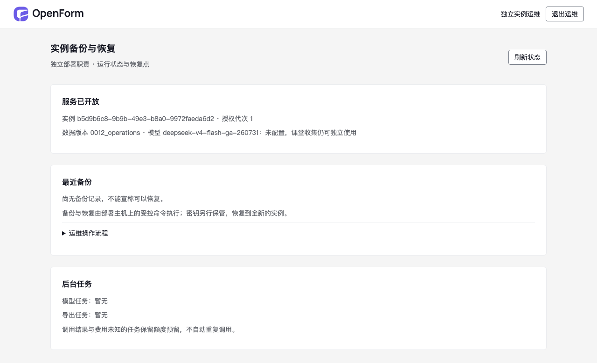
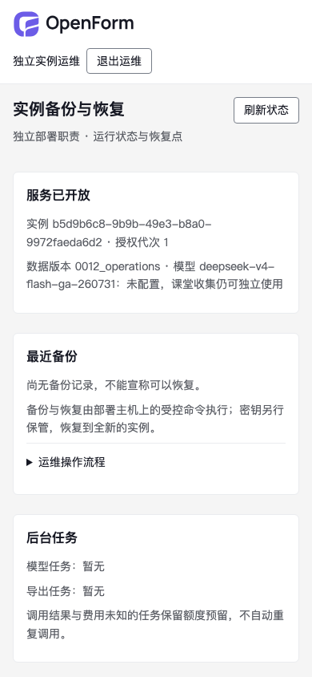
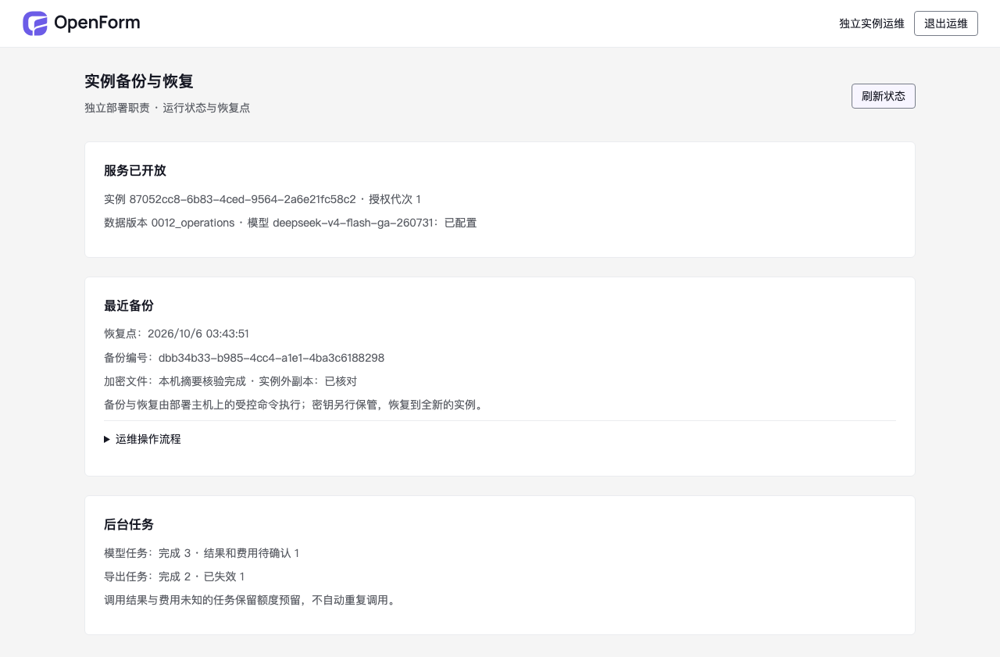
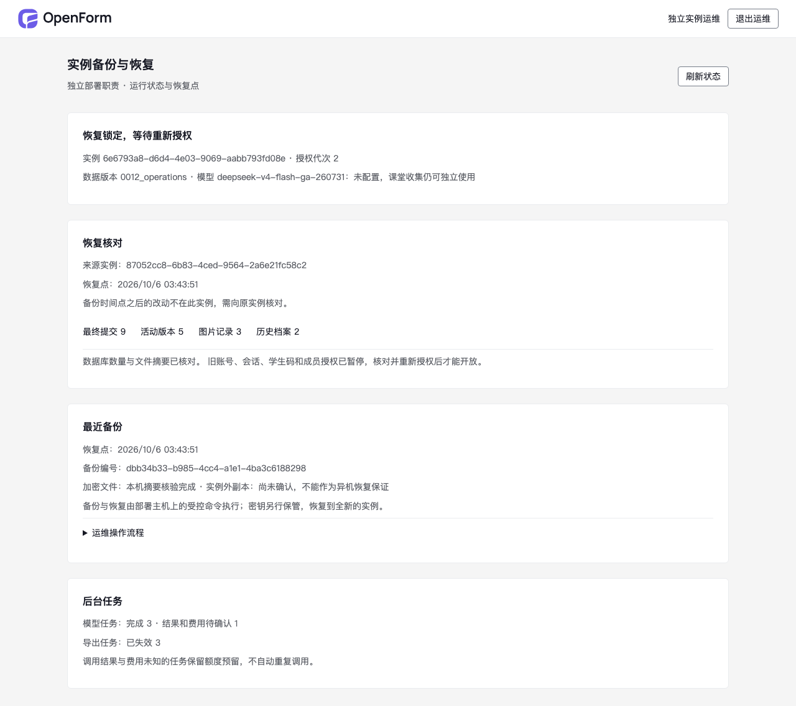
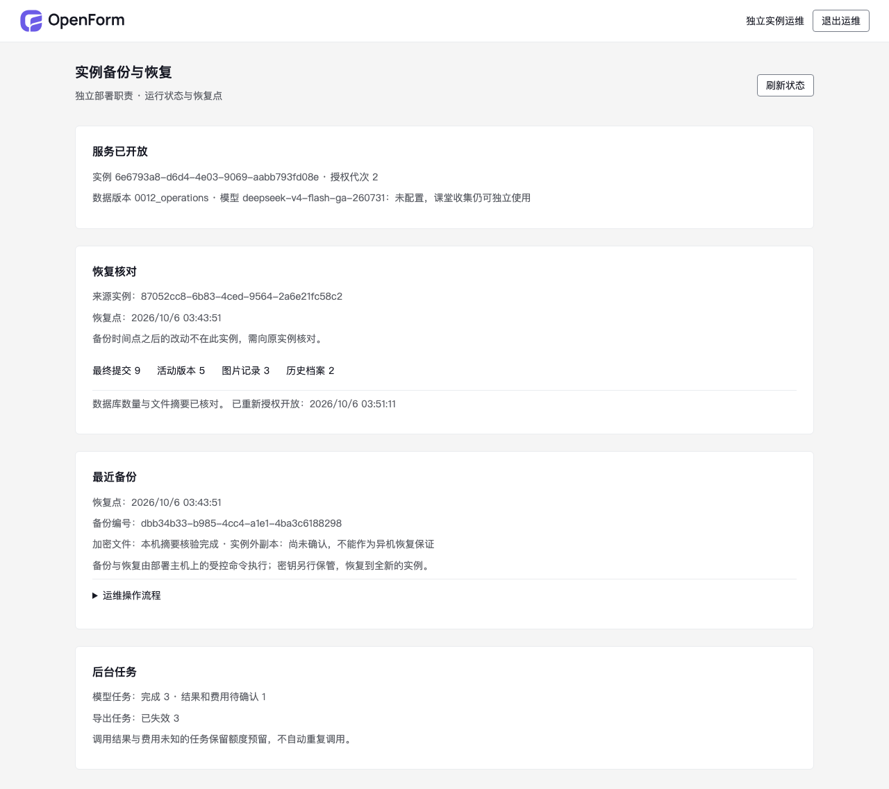
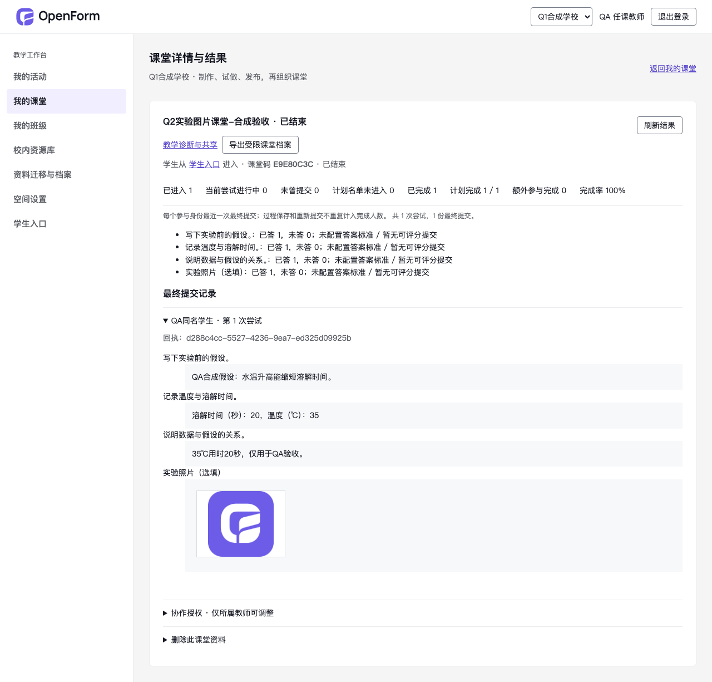

# Q5 安装、升级、备份与锁定恢复 QA

**DONE_WITH_CONCERNS**。一次 `/qa`，范围仅 E12 交付链；修复后只继续失败的安装步骤。没有新增或执行自动化测试、覆盖率、压力测试、模型评测或第二轮全量 QA。Aside 不可用，使用 gstack 自有浏览器；只操作本轮自建标签页及合成账号。

| 字段 | 实际值 |
|---|---|
| 日期 / 时段 | 2026-10-06，03:33–03:56（北京时间） |
| 应用 | `https://www.openforgeai.cn/#O01`；隔离演练 `http://localhost:18912/#O01`、`http://localhost:18920/#O01`、恢复后 T06 |
| 实现 / PR | `03432a2a168a70a3dbc84b1930d664c20683f4b1`；[PR #34](https://github.com/zssggle-rgb/openform/pull/34)，main `2b45a4e5a89c22a3c5c99c506f6ae4284030d334` |
| 运行环境 | 腾讯云同一 Ubuntu 24.04 amd64 主机，Docker / Compose 5.3.1、PostgreSQL 18，schema `0012_operations` |
| 浏览器页面 / 截图 | O01 安装、来源、恢复三个实例及恢复后 T06；8 张截图，逐张已读取 |
| 框架 | React / Vite、FastAPI、SQLAlchemy |
| 在线 CI | PR #34 合并时 scope 仍排队；没有强制 CI 门禁，未登记为在线检查通过。相关本地格式/类型及实际镜像构建通过，未运行测试 |

## 结果及边界

Q5 内发现 2 项中等交付问题，均在同一任务内修复并沿失败路径继续。最终安装、备份、恢复和重新授权的主要流程走通；不代表独立物理主机、校园断公网、所有学生设备或 500 人课堂验收。

局部健康分数 95 → 100：Console、Links、Visual、UX 各 100，Functional 84 → 100，按已观察项权重归一。仅限本轮入口与流程；Performance、Accessibility 和全站导航未评，不计入分数。不能把局部分数用于正式校园放行。

控制台有 12 条预期 HTTP 401/503：未登录、主动使用撤销凭据，以及恢复锁定中的业务拒绝；没有观察到本轮入口的未处理 JS 异常。维护期间业务停止是预期。浏览器过期 snapshot 引用及域名执行限制是工具状态，未登记为产品缺陷。

| 严重级别 | 发现 / 修复 / 未解决 |
|---|---|
| Critical / High / Low | 0 / 0 / 0 |
| Medium | 2 / 2 / 0 |

## 发行与实际安装

| 产物 | 值 |
|---|---|
| 版本 / 源码 | `openform:v0.1.0-rc.2` / `03432a2a168a70a3dbc84b1930d664c20683f4b1` |
| 应用镜像 ID | `sha256:d2c23ae265b9afbe2910414572c25f334e3b927b4c7f4d78d7578722bacec52a` |
| 归档 | `/srv/openform/packages/openform-v0.1.0-rc.2-linux-amd64.tar`，239,667,200 字节；同目录 `.sha256` |
| 归档 SHA-256 | `a55ae49a943bee0116437a9cdc7a1de9f8c5a0df7d17127bd04d92701c6d6447` |
| 数据库离线引用 | `openform-postgres:18-5a5a84b1`；release.json 核对其 ID，Docker load 实际加载应用和数据库两个名称 |

归档包含提交源码、锁文件、已构建 Web、应用/数据库镜像及逐文件清单；不包含部署凭据。核对外部摘要、内部清单后，在新目录及全新项目 `openform-q5-install-rc2` 加载镜像、初始化独立凭据并安装。没有下载依赖或自动 pull/build。容器网络 `internal=true`，初始数据库为空，实例 `b5d9b6c8-9b9b-49e3-b8a0-9972faeda6d2` / 代次 1。

浏览器从独立运维登录进入 O01，显示“没有成功备份”和“模型未配置”，没有把未知显示为零次成功。390px 页面没有横向溢出，正式 Logo 可见。

`--offline` 的内部 Docker 网络不发布主机 loopback 端口。本轮使用 SSH 转发连接实际容器内部地址；[安装说明](../operations/linux-operations.md)已明确正式网关的上游配置。主机预装了 Docker/GnuPG，也可访问公网；这不是“全新物理服务器断公网安装”。GHCR 工作流未执行、镜像未发布到注册表。

## 维护升级

原 QA 在保留业务卷和升级前私有加密快照的维护窗口，实际从 `0011_transfers` 迁移到 `0012_operations` 并部署 rc.2；readiness 恢复 200。没有清空原业务资料或其他项目。

另外在新安装的空实例上执行了一次交付的 `upgrade --image openform:v0.1.0-rc.2` 命令：持续维护备份、迁移到当前 head、受限 DB 角色/schema 核对、恢复服务和持久化镜像成功。升级前备份编号 `f9b3f91c-52cc-4689-a66e-cf1ea6fd3a9a`，密文 SHA-256 `cdfba7a8344c4ce2415601099f2b7d578c7c219fd2da1c841441aea90407c5ab`。这次 CLI 流程是同版本维护验证，不能登记为未来版本或未知 schema 的兼容证明。

## 加密备份、实例外拷贝与恢复

来源 `openform-e02`，实例 `87052cc8-6b83-4ced-9564-2a6e21fc58c2` / 代次 1。实际 `backup` 在维护及停止写入后执行数据库 custom dump、文件副本、记录/图片摘要核对、GnuPG AES-256 加密，再解密核对，成功恢复来源服务。

| 备份 | 实际值 |
|---|---|
| 编号 | `dbb34b33-b985-4cc4-a1e1-4ba3c6188298` |
| 时间 | `2026-10-05T19:43:51.298388+00:00`，北京时间 03:43:51 |
| 文件 | `/srv/openform/backups/q5-03432a2.gpg` 及 `.gpg.json`，221,010 字节 |
| 密文 SHA-256 | `981a4e342fb918a1a545be5b1644b0bf23261d6b532f69b170960d2b044adcae` |
| 实例外副本 | Mac `/Users/sjs/.local/share/openform-qa-backups/`，目录 0700、文件 0600；摘要一致，密钥在独立受限目录 |

复制并核对摘要后才 `ack-offsite`。O01 显示本机核验和实例外副本已核对；CLI 的确认本身不替代实际拷贝事实。使用 Mac 上的副本回传到受限恢复输入路径，而非直接拿原服务器文件宣称异机恢复。

`openform-q5-restore` 使用新目录、全新卷、重新生成 DB/运维凭据及备份对应的同一应用镜像。解密/清单/图片核对、PG 事务恢复和恢复锁定均成功：

| 核对项 | 快照 / 恢复 |
|---|---|
| 空间、活动、活动版本 | 4 / 4，6 / 6，5 / 5 |
| 课堂、尝试、最终提交 | 4 / 4，14 / 14，9 / 9 |
| 图片记录、历史档案、档案记录 | 3 / 3，2 / 2，1 / 1 |
| 新实例 / 代次 | `6e6793a8-d6d4-4e03-9069-aabb793fd08e` / 2 |
| 恢复初始状态 | maintenance=true，restored_locked=true；readiness 503，worker/cleanup 尚未启动 |

来源启动清理服务后，Q4 已明确删除的课堂资料按既有规则清理；备份时提交数为 9，恢复后也是 9。启动前观察到的 10 不能拿来宣称恢复丢失一条。

旧有效教师/学生/运维 cookie 恢复后被拒绝。新运维凭据能在锁定期间进入 O01，显示一致的资料数量和“备份时间点之后的改动不在此实例”；恢复目标的实例外副本状态重新为未确认，没有继承来源的确认。导出任务 3 条失效，模型已完成 3 条、结果未知 1 条仍保留，没有增加模型调用。

按 0600 私有文件显式重新授权合成校管与教师，设置新密码，再执行 `recovery-open`，于北京时间 03:51:11 开放。readiness 200；旧教师/学生会话仍为 401，旧学生个人码为 401。新密码通过真实浏览器登录，打开 Q2 实验课堂的原回执和合成图片；图片自然宽度 512、加载成功。来源 QA 的 O01 和 readiness 保持开放。

## 修复及证据

### ISSUE-001：新安装迁移命令使用 Compose run 不支持的选项

Medium / Functional。rc.1 完成空 PG 初始化后，`install` 的 migration 子命令失败：`unknown flag: --no-build`。Compose `up` 支持该选项，`run` 不支持。

`03432a2` 仅为 `up` 添加 `--no-build`；`run` 先检查本地应用镜像，再使用 `--pull never`。rc.2 在新项目实际迁移至 0012、启动及 O01 登录成功。CLI 问题使用命令退出/错误事实记录，没有虚构浏览器失败截图；修复后 UI 见安装截图。

### ISSUE-002：数据库镜像仅按 digest 导出，离线归档没有可用名称

Medium / Functional。rc.1 `images.tar` 中数据库条目 `RepoTags=null`，Docker load 只显示 image ID；未保留原 digest 引用的安装主机会缺少 Compose 所需的引用。

`03432a2` 保存显式数据库离线 tag，并在 release.json 记录 tag/ID；新安装使用已核对的别名。rc.2 的 Docker load 实际打印两个镜像名称，安装无需 pull 即完成。rc.1 包不作为发行产物。

| 问题 | 状态 / 改动 |
|---|---|
| ISSUE-001 | verified，`03432a2`，`deploy/admin.py` |
| ISSUE-002 | verified，`03432a2`，`deploy/release.py` 及初始化读取归档 metadata |

按用户要求未增加回归测试文件、未运行原有自动化测试；仅沿失败交付步骤定点复查。同一任务的一次 review 记录见 [E12](e12-operations-review-2026-10-06.md)，没有对整个应用重复 review/QA。

## 未验收项

独立干净物理主机、校园真实断公网和双域 HTTPS、全部学生设备、恢复后所有权限类型的完整矩阵、未来 schema 升级、错误备份/磁盘耗尽/进程中断故障矩阵均未验收。真实课堂和 500 人容量按 [E13 状态](../acceptance/release-gates-2026-10-06.md)保持开放；本轮不追加对应测试。QA 临时实例在演练后停止、卷和记录保留，主 QA 应用继续运行。
